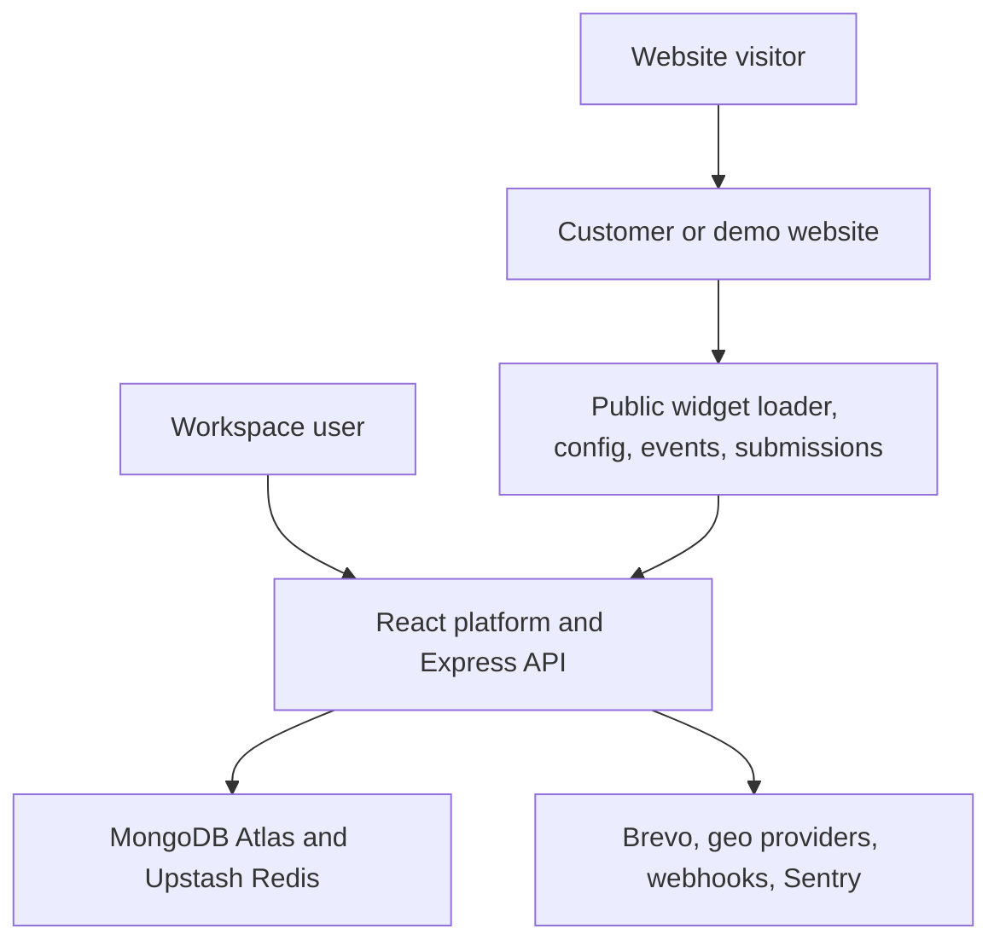
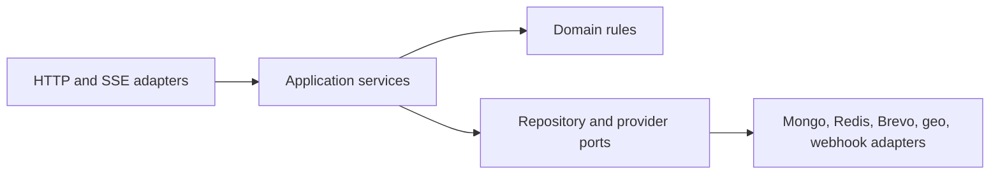
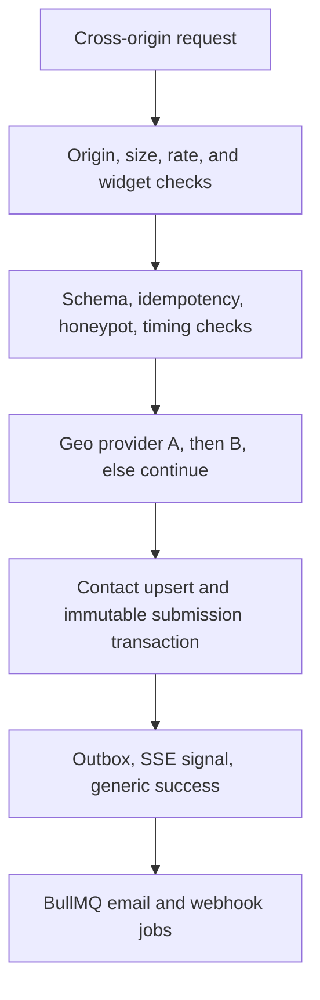

# Embeddable Widget & Lead-Capture Platform

## Complete Application Architecture Blueprint and Staged Implementation Plan

**Status:** Discovery complete - architecture approved for planning  
**Version:** 1.0  
**Date:** 2026-08-27  
**Implementation status:** No application code has been written by this document

---

## 1. Purpose of this blueprint

This document is the single source of truth for version 1 of the Embeddable Widget & Lead-Capture Platform. It combines:

- every mandatory requirement and acceptance probe from the FlyRank capstone brief;
- every product, security, data, testing, deployment, and operational decision made during discovery;
- the expanded full-stack scope built around React, Express, MongoDB, Redis, and TypeScript;
- a dependency-ordered implementation plan that can later be executed one stage at a time.

Implementation prompts must preserve this blueprint. A later stage may refine internal details, but it must not silently change a locked decision.

---

## 2. Product mission

The platform lets a customer create configurable lead-capture widgets, publish them, and install them on permitted websites with one script tag. Website visitors can interact with those widgets and submit leads from external origins. The platform validates and protects every public request, enriches valid submissions with approximate location data, stores contacts and immutable submission events, runs non-blocking email and webhook side effects, and presents the results through a collaborative dashboard and analytics system.

Version 1 is a public, production-like portfolio demonstration. Anyone may register, but the public deployment is intended for synthetic or test data and visibly discloses free-tier limitations. It is not presented as a service with a commercial uptime or data-durability guarantee.

### Primary success outcome

A user can register, verify their email, create a workspace and widget, publish it for an allowed domain, paste one generated script tag into a separate-origin website, submit a valid lead, see that lead appear live in the dashboard, and inspect evidence that validation, tenant isolation, caching, abuse protection, geo fallback, and failure-safe side effects work correctly.

---

## 3. Explicit version 1 non-goals

The following are intentionally excluded:

- billing, subscriptions, paid plans, or payment processing;
- customer API keys or external access to management and lead APIs;
- social login, enterprise SSO, or mandatory MFA;
- arbitrary custom widget types;
- arbitrary customer JavaScript, custom CSS, or unrestricted HTML templates;
- file-upload fields or attachment storage;
- a full email-marketing campaign engine;
- CRM automation beyond statuses, assignments, notes, tags, notifications, and webhooks;
- domain-ownership verification;
- a real CDN, custom domain, paid always-on worker, staging environment, or formal SLA;
- real customer data in the hosted portfolio demo;
- a mobile application;
- legacy-browser support.

These non-goals keep the system complete and demonstrable without allowing the expanded scope to bury the capstone's core backend requirements.

---

## 4. Locked product decisions

### 4.1 Accounts, workspaces, and roles

| Area | Version 1 decision |
| --- | --- |
| Registration | Public registration for anyone |
| Tenant model | Shared workspaces with role-based access |
| Workspace membership | A user may join many workspaces and uses a workspace switcher |
| Ownership limit | A verified user may own one workspace at a time and join many others |
| First workspace | Created during onboarding; user supplies its name and confirms the detected timezone |
| Roles | Owner, Admin, Member |
| Member widget access | Create and edit widget drafts; cannot delete, publish, or unpublish |
| Member lead access | View contacts/submissions; change status, notes, tags, and assignment; no export or deletion |
| Admin access | All content and workspace settings except ownership-only actions |
| Membership administration | Admins manage Members; only Owner assigns or removes Admin status |
| Publishing | Owner and Admin only; verified account required |
| Ownership transfer | Owner may transfer to a verified Admin |
| Invitations | Email link; recipient logs in or registers; invitation expires after 7 days |
| Unverified access | Dashboard is available, but publishing and invitations are blocked |
| Workspace deletion | Owner soft-deletes; recoverable for 30 days; permanent purge follows |
| Account deletion prerequisite | User must first transfer or permanently resolve the workspace they own |

### 4.2 Authentication and account security

| Area | Version 1 decision |
| --- | --- |
| Primary authentication | Email and password |
| Email flows | Verification and password reset |
| Password storage | Argon2id |
| Password policy | Minimum 12 characters, strength feedback, and common/breached-password blocking |
| MFA | Optional authenticator-app TOTP for every user; encouraged for Owner/Admin |
| Sessions | Server-side sessions in Redis |
| Session lifetime | 7 days of inactivity or 30 days absolute maximum |
| Session controls | Device/session list and individual or global revocation |
| Account deletion | Sessions revoked immediately; account recoverable for 30 days; profile PII then purged and historical actor references anonymized |
| Security audit | Authentication, membership, settings, publishing, exports, and deletions |

### 4.3 Widget catalog and builder

Version 1 contains exactly three widget types:

1. **Contact form** - defaults to name, email, subject, and message. Email and message cannot be removed.
2. **Email signup form** - captures newsletter or marketing leads. Email cannot be removed.
3. **CTA popover** - shows a promotional message and action button. The button opens an external URL or the widget's built-in lead form; when lead capture is enabled, email cannot be removed.

Creators build widgets through a settings form with a live preview. They may add and remove predefined fields, subject to the locked mandatory fields.

Supported predefined fields are:

- name;
- email;
- subject;
- message;
- phone;
- company;
- checkbox/consent.

Each field supports:

- label and placeholder;
- help text;
- required or optional state;
- maximum length within platform boundaries;
- field order.

Visual customization supports:

- colors;
- typography;
- spacing;
- border radius;
- button style.

Arbitrary CSS and JavaScript are not accepted.

### 4.4 Display, targeting, and visitor behavior

| Area | Version 1 decision |
| --- | --- |
| Form modes | Inline or modal |
| CTA mode | Floating popover |
| Opening triggers | Click, delay, scroll depth, exit intent |
| CTA actions | External URL or built-in lead form |
| Valid-submission outcome | Configurable success message or validated redirect URL |
| Allowed domains | At least one is required before publishing |
| Host matching | Exact hosts plus explicit wildcard subdomains |
| Wildcard rule | `*.example.com` does not include `example.com`; both must be listed when both are allowed |
| Domain proof | Not required; the backend enforces the configured allowlist against request Origin |
| Page targeting | Include and exclude URL patterns, represented as safe glob patterns rather than executable regular expressions |
| Repeat appearances | Configurable session-only or multi-day cooldown |
| Visitor identity | Per-widget pseudonymous identifier in the host origin's localStorage, rotated every 30 days |
| Multiple widgets | Multiple instances may coexist on one page; the shared runtime loads only once |

Exit intent is desktop-capable behavior. On browsers where it cannot be meaningfully detected, the widget does not fake the trigger; another configured trigger may still open it.

### 4.5 Publishing lifecycle

- Every widget has a stable identity and separately versioned revisions.
- Editing a published widget creates or updates a draft revision.
- Members may edit the draft but cannot change the live revision.
- Owner/Admin explicitly publishes the draft, making it the new immutable live revision.
- Unpublishing immediately blocks new config use and submissions at the backend.
- Owner/Admin may soft-delete a widget for 30 days.
- Deleting a widget does not delete its historical contacts or submission events.
- Restoring a widget does not automatically republish it.

### 4.6 Contacts and submissions

The platform distinguishes a **Contact** from a **Submission Event**:

- A Contact is unique by normalized email within a workspace.
- Repeated submissions from the same normalized email update or attach to the same workspace Contact.
- Every accepted submission creates an immutable Submission Event containing the widget revision, submitted field snapshot, domain, page URL, consent snapshot, geo result, and timestamps.
- Canonical contact details may be edited or merged by Owner/Admin.
- Manually edited canonical values are not silently overwritten by a later submission; the new raw values remain visible in its immutable event.
- Status, assignee, tags, and internal notes live on the Contact.
- Submission Events form the source timeline for that Contact.

Lead statuses are:

1. New
2. Contacted
3. Qualified
4. Converted
5. Archived

Archiving is a workflow state. Deletion is a separate soft-delete operation.

### 4.7 Lead inbox and collaboration

The inbox supports:

- search across name, email, and captured field values;
- filters for status and submission date;
- widget, domain, and page URL;
- assignee and tags;
- country and city;
- cursor-based pagination and deterministic sorting;
- filtered CSV and JSON export for Owner/Admin;
- live arrival through Server-Sent Events;
- 30-day soft deletion and recovery for individual Contacts.

Bulk permissions:

- Owner/Admin: status, assign, tag, archive, soft-delete, and export;
- Member: status, assign, and tag;
- recovery and permanent-deletion controls remain Owner/Admin only.

### 4.8 Consent and contact privacy

| Area | Version 1 decision |
| --- | --- |
| Marketing opt-in | Workspace-selectable single or double opt-in; default double |
| Consent evidence | Immutable event stores consent text/version, timestamp, source, widget revision, and relevant pseudonymous metadata |
| Unsubscribe | Workspace-wide marketing suppression; essential transactional messages remain allowed |
| Contact self-service | Email-verified flow to export data or request deletion within one workspace |
| Public policies | Privacy policy, terms, localStorage/cookie notice, acceptable-use policy |
| Active contact retention | Workspace-configurable; default 12 months |

Recommended retention choices exposed to the workspace are 30 days, 90 days, 12 months, or indefinite. The public demo defaults to 12 months.

An email-verified privacy deletion permanently removes or irreversibly anonymizes the contact's PII and submission values for that workspace. Minimal suppression data may remain when necessary to honor an unsubscribe, and aggregate analytics remain non-identifying.

### 4.9 Analytics

The runtime records these anonymous funnel events:

- impression;
- open;
- CTA click;
- form start;
- successful submission.

The dashboard presents:

- counts and trends over time;
- funnel conversion by widget;
- per-widget performance;
- country and city breakdown;
- top allowed domains and page URLs;
- conversion by Contact status;
- email and webhook delivery health;
- spam and rate-limit activity.

Raw interaction events are retained for 90 days, then removed after daily aggregates are produced. Delivery logs are retained for 90 days. Audit logs are retained for 12 months.

### 4.10 Usage limits

Each workspace receives visible usage meters and these hard public-demo limits per workspace:

- 10 active widgets;
- 10 total users, including the Owner;
- 2,000 accepted submissions per workspace month;
- 20,000 interaction events per workspace month.

Monthly boundaries use the workspace timezone. Platform-wide safety controls may reject or defer work earlier when a shared provider limit is at risk.

---

## 5. System context and deployment topology

### 5.1 Production services

| Component | Production choice | Responsibility |
| --- | --- | --- |
| Main hosting | One Render Web Service | Runs Express, serves the built React application, serves widget assets/config, exposes APIs and SSE, and runs BullMQ workers in the same process |
| Demo hosting | Separate static site/subdomain | Creates a real second origin and hosts the anonymous live sandbox |
| Database | MongoDB Atlas free cluster | Durable application data |
| Redis | Persistent Upstash Redis with usage monitoring | Sessions, shared rate limits, BullMQ, idempotency keys, short-lived caches, SSE fan-out metadata, quota counters |
| Email | Brevo | Verification, reset, invitation, privacy, opt-in, confirmation, workspace notification |
| Geo provider A | ip-api.com | Primary IP-to-geo enrichment |
| Geo provider B | ipapi.co | Fallback enrichment |
| Error monitoring | Sentry Developer plan | Application errors and release visibility with PII scrubbing |
| Source and CI | One public GitHub repository + GitHub Actions | History, checks, evidence, automated deployment gate |

Production is EU-first: Frankfurt for Render and Upstash where available, and the closest available free EU region for Atlas.

### 5.2 Free-tier operational posture

- The Render Web Service may sleep after inactivity.
- BullMQ jobs remain persisted in Upstash and resume when the service wakes.
- Pending or delayed delivery states are shown honestly in the dashboard.
- The system does not use artificial keep-awake traffic.
- Atlas free-tier backup and availability limitations are disclosed.
- The repository documents encrypted export/restore procedures and supplies reproducible seed data; there is no automated cloud backup in version 1.
- The hosted instance is for synthetic/test data and carries no SLA.

### 5.3 Brevo daily budget

The 300-message daily provider allowance is protected by priority queues:

- 100 messages reserved for authentication and privacy-critical flows;
- at most 200 messages used for visitor confirmation and workspace notification side effects;
- excess non-critical email remains queued until the next provider allowance window;
- provider usage and deferred counts are visible to operators;
- public sandbox email is disabled, so it cannot consume the allowance.

Authentication/privacy jobs always outrank side-effect jobs. Permanent delivery failures are never retried as though they were transient.

---

## 6. Repository and package architecture

The project lives in one dedicated public repository and uses npm workspaces. It is technically a workspace monorepo containing only the related parts of this single capstone product.

| Workspace/path | Responsibility |
| --- | --- |
| `apps/server` | Express API, static serving, SSE, and worker bootstrap |
| `apps/web` | React platform, public pages, and dashboard |
| `apps/demo` | Separate-origin anonymous sandbox |
| `packages/contracts` | Shared TypeScript contracts and validation schemas |
| `packages/database` | Mongo models, repositories, indexes, and migrations |
| `packages/widget-runtime` | Framework-free TypeScript loader/runtime build |
| `packages/ui` | Shared accessible React components and design tokens |
| `packages/config` | Shared lint, TypeScript, test, and build configuration |
| `packages/test-utils` | Fixtures, provider fakes, and tenant helpers |
| `docs` | Architecture decisions and operational runbooks |
| Repository root | README, capstone manifest, evidence/build logs, environment example, license, and Docker Compose configuration |

This is a conceptual ownership map, not generated code or a mandate for every directory to exist on day one.

### 6.1 Capstone repository caveat

The PDF says the capstone must be in one dedicated repository and also warns against building it in a monorepo. The selected npm-workspaces organization is technically a monorepo. The decision is preserved because every workspace belongs to this one application, but it must be disclosed in the design document and README as an intentional full-stack expansion. If an evaluator interprets “no monorepo” literally, this is a known submission risk.

### 6.2 Layering rule

Every server feature follows the same dependency direction:

Routes do not contain tenant queries, provider logic, or business workflows. Domain/application services do not depend on Express objects. Provider failures are converted into explicit results rather than leaking transport-specific exceptions into core logic.

---

## 7. Actor-specific request paths

### 7.1 Authenticated management path

1. Browser sends a secure session cookie to the same-origin Express API.
2. Session middleware resolves the user and selected workspace.
3. CSRF protection validates state-changing requests.
4. Membership and verification gates authorize the action.
5. The application service performs a workspace-scoped operation.
6. Durable audit and activity records are appended.
7. The API returns a versioned JSON result; relevant live updates are emitted through SSE.

### 7.2 Widget load path

1. Customer page loads a one-line stable script snippet containing a public widget identifier.
2. The loader, cached for 5 minutes, ensures the shared runtime is loaded only once.
3. The loader fetches the content-hashed runtime, cached for one year with `immutable` semantics.
4. The runtime requests the published config with the page Origin and current URL.
5. The backend confirms the widget is published, not deleted, within quota, and permitted for that Origin.
6. Config is returned with a 60-second browser cache and ETag.
7. The runtime evaluates include/exclude patterns, trigger rules, and cooldown state.
8. The widget renders inside Shadow DOM and records allowed anonymous interaction events.

The public config contains only renderable settings. It never includes email recipients, webhook URLs/secrets, internal notes, tenant identifiers, or other private settings.

### 7.3 Public submission path

Detailed rules:

1. The production endpoint requires an allowed browser Origin. CORS headers alone are not treated as authentication.
2. The server rejects bodies over 32 KB, more than 20 fields, or long-text values above 5,000 characters with a clean 4xx JSON error.
3. Shared Redis limits enforce:
   - 5 submissions per minute per IP-widget pair;
   - 30 per hour per IP-widget pair;
   - 100 per minute per widget.
4. The server loads the current published revision and validates the payload against its server-owned field schema.
5. A widget-generated idempotency key is retained for 24 hours. A retry returns the original generic result and creates no duplicate event or side effect.
6. A filled honeypot or failed timing heuristic produces a generic success, creates no Contact, and records only a minimal Abuse Event.
7. Raw IP is used transiently for request processing and rate limiting but is never persisted.
8. Geo provider A is attempted with a strict timeout, then provider B. If both fail, storage still succeeds without geo.
9. Contact upsert, immutable Submission Event, consent evidence, quota accounting, and a durable outbox record are committed together where possible.
10. The endpoint returns a uniform generic 2xx response that does not reveal spam classification.
11. Email, webhook, and workspace notification work occurs after the primary commit and can never reverse the accepted submission.

Domain and page URL values are useful source metadata but are not trusted authorization evidence. Authorization uses the validated request Origin and fresh server-owned widget settings.

### 7.4 Spam and rate-limit evidence

AbuseEvent stores only what is necessary for aggregate evidence:

- workspace and widget identifiers;
- rotating IP HMAC pseudonym;
- event type such as honeypot, timing heuristic, or rate limit;
- timestamp and coarse source information;
- no captured form-field values.

This lets the dashboard prove protection without turning rejected spam into a shadow lead database.

---

## 8. Widget delivery and runtime architecture

### 8.1 Runtime technology

- Framework-free TypeScript keeps the public bundle small and avoids shipping React to customer websites.
- Shadow DOM isolates markup, tokens, focus styles, and widget CSS from the host.
- The loader maintains a page-level registry so multiple script tags share one runtime.
- Each instance has its own public widget ID, Shadow root, event state, and cleanup lifecycle.
- Global listeners needed for scroll or exit intent are registered once and dispatch to eligible instances.

### 8.2 Cache contract

| Asset | Cache behavior | Invalidation |
| --- | --- | --- |
| Stable loader | 5-minute cache | New loader behavior reaches clients within the short window |
| Content-hashed runtime | 1 year, public, immutable | New build produces a new URL/hash |
| Published config | 60 seconds + ETag | Publish invalidates Redis; browser revalidates after short TTL |

The submission endpoint always checks current server state. A briefly cached config cannot bypass unpublishing, deletion, an updated allowed-domain rule, or a quota block.

### 8.3 Performance budgets

The staged build should establish measurable budgets rather than promise an arbitrary number before bundling:

- loader and runtime size are tracked in CI;
- no dashboard framework enters the widget bundle;
- configuration remains a small JSON document;
- public API response timing excludes non-critical email/webhook work;
- geo calls have strict per-provider timeouts and short Redis caching by rotating IP pseudonym.

---

## 9. Data architecture

### 9.1 Tenancy invariant

Every tenant-owned durable record contains `workspaceId`. All repository methods require workspace scope as an explicit input. The selected workspace comes from authenticated session context, never from an untrusted request body. Public widget identifiers resolve to one workspace on the server.

Cross-tenant tests are mandatory for every read, update, delete, export, analytics, SSE, trash, and recovery path.

### 9.2 Principal collections and records

| Record | Purpose | Important constraints/indexes |
| --- | --- | --- |
| User | Login identity, verification state, security profile | Unique normalized email; deletion state; one-owned-workspace invariant enforced with Workspace data |
| Workspace | Tenant, owner, timezone, retention, usage policy | Unique owner user for active ownership; soft-deletion fields |
| Membership | User role within workspace | Unique workspace-user pair; role index |
| Invitation | Pending role invitation | Hashed token, email, role, inviter, 7-day expiry, status |
| Widget | Stable identity and lifecycle | Unique public ID; workspace + status; soft deletion |
| WidgetRevision | Immutable published or editable draft configuration snapshot | Workspace + widget + revision number unique; published timestamp/actor |
| Contact | Workspace-level canonical lead and CRM state | Unique workspace + normalized email for active records; status/assignee/tag/date indexes |
| SubmissionEvent | Immutable captured-field and source snapshot | Workspace/contact/date; widget/date; domain/page/geo indexes |
| ConsentEvent | Append-only opt-in, confirmation, withdrawal evidence | Workspace/contact/date and immutable text/version snapshot |
| ContactActivity | Status, assignment, tags, notes, merge, and actor history | Workspace/contact/date |
| InteractionEvent | Raw anonymous funnel event | Workspace/widget/date; automatic expiry after 90 days |
| DailyAnalytics | Long-lived aggregate counters | Unique workspace/widget/day/dimensions |
| AbuseEvent | Minimal spam and rate-limit evidence | Workspace/widget/type/date; no form values |
| Delivery | Email/webhook job and attempt history | Workspace/type/status/date; expires after 90 days |
| WebhookEndpoint | Encrypted endpoint settings and secret metadata | Workspace/widget; enabled state; secret version |
| OutboxEvent | Durable promise to enqueue a background job | Status/next-attempt index and idempotency key |
| AuditEvent | Security/workspace accountability | Workspace/type/date; expires after 12 months |
| PrivacyRequest | Verified export/deletion workflow | Workspace/contact/status/token-expiry |

Sessions, rate counters, public idempotency results, short caches, live event channels, and fast quota counters live in Redis. Durable business truth stays in MongoDB.

### 9.3 Data-change policy

- Published WidgetRevision and SubmissionEvent records are immutable.
- Contact canonical values use optimistic concurrency to prevent silent overwrites by teammates.
- Contact merge selects a surviving Contact, re-links events and activities, preserves an audit trail, and retires the duplicate.
- Every role, publish, export, delete, restore, merge, and settings change records the actor and request correlation ID.
- Mongo schema changes are handled through committed, repeatable migrations and explicit index management rather than uncontrolled startup mutations.

### 9.4 IP and geo privacy

- Raw IP exists only during the request and in transient rate-limit processing.
- A monthly rotating HMAC pseudonym supports short-term abuse analysis without indefinite visitor linkage.
- HMAC secrets are derived from protected environment key material and versioned by rotation period.
- Persisted geo is approximate and contains only fields useful to the chosen analytics, such as country code/name, region, city, timezone, and provider/fallback status.
- Logs and Sentry events remove IPs, emails, captured values, tokens, and secrets.

### 9.5 Retention and deletion

| Data | Retention/deletion rule |
| --- | --- |
| Active contacts/submissions | Workspace setting; default 12 months |
| Contact trash | Recoverable for 30 days, then PII/submission values purged or anonymized |
| Widget trash | Recoverable for 30 days; historical contacts/submissions remain |
| Workspace trash | Owner recovery for 30 days, then tenant purge |
| Account deletion | Recoverable for 30 days; memberships/profile removed and historical actor references anonymized |
| Raw interaction events | 90 days, then TTL deletion after aggregation |
| Delivery logs | 90 days |
| Audit logs | 12 months |
| Redis sessions/idempotency/caches | Purpose-specific TTL |

Cleanup jobs run on a schedule when the service is active and also run bounded catch-up sweeps during startup, so Render sleep delays but does not permanently skip retention work.

Active Contact retention is measured from the latest retained submission or intentional workspace activity on that Contact. Non-identifying daily analytics aggregates remain while the workspace exists; workspace deletion purges them.

---

## 10. API architecture

### 10.1 Contract rules

- JSON REST API under a versioned `/api/v1` boundary.
- OpenAPI is the contract source and is rendered through Swagger UI.
- No customer API keys in version 1.
- Dashboard APIs use server sessions and CSRF protection.
- Public widget APIs use opaque public widget IDs, current published state, allowed-Origin enforcement, rate limits, and server-owned schemas.
- List endpoints use cursor pagination and explicit sort/filter contracts.
- Error payloads use a consistent machine-readable code, safe message, field details when appropriate, and request correlation ID.
- Expected client failures return suitable 4xx statuses; malformed or oversized input never becomes a 500.
- Update operations that can conflict use revision/version preconditions and return 409 on stale writes.

### 10.2 API groups

| Group | Main responsibilities |
| --- | --- |
| Authentication | Register, verify, login/logout, reset, MFA setup/challenge/recovery, sessions/devices, account deletion/recovery |
| Workspaces | Onboarding, switch context, members, roles, invitations, ownership transfer, usage, retention, delete/recover |
| Widgets | CRUD, drafts, revisions, preview data, publish/unpublish, install snippet, trash/recovery, domains, targeting, email/webhook settings |
| Public widget | Loader/runtime assets, published config, interaction events, submissions |
| Contacts | Inbox, detail/timeline, workflow changes, notes, tags, assignment, merge, bulk operations, trash/recovery |
| Exports | Stream filtered CSV or JSON with permission and audit enforcement |
| Analytics | Trends, funnel, widget, geo, source, status conversion, abuse, delivery health |
| Deliveries | Attempt history, dead-letter view, manual replay, webhook secret rotation |
| Privacy | Unsubscribe, opt-in confirmation, verified contact export/deletion |
| Operations | Health, readiness, safe queue state, and operator-only diagnostics |

### 10.3 Browser session security

- Cookie is Secure, HttpOnly, scoped narrowly, and uses an appropriate SameSite policy.
- Session identifier rotates after authentication, password change, MFA change, and privilege-sensitive events.
- CSRF token is required for authenticated state-changing requests.
- Revocation is immediate through Redis session deletion and per-user session indexing.
- Generic login/reset responses prevent account enumeration.
- Login, registration, verification resend, reset, invitation acceptance, and privacy-email flows each have dedicated Redis throttles.

---

## 11. Roles and authorization matrix

| Capability | Owner | Admin | Member |
| --- | :---: | :---: | :---: |
| View workspace dashboard | Yes | Yes | Yes |
| Create/edit widget draft | Yes | Yes | Yes |
| Publish/unpublish widget | Yes, verified | Yes, verified | No |
| Delete/recover widget | Yes | Yes | No |
| View contacts/submissions | Yes | Yes | Yes |
| Change status/assignee/tags/notes | Yes | Yes | Yes |
| Edit/merge canonical Contact | Yes | Yes | No |
| Export leads | Yes | Yes | No |
| Soft-delete/recover leads | Yes | Yes | No |
| Manage webhook/email settings | Yes | Yes | No |
| View delivery operations | Yes | Yes | Limited per-lead activity only |
| Invite/remove Members | Yes | Yes | No |
| Assign/remove Admin role | Yes | No | No |
| Transfer ownership | Yes | No | No |
| Delete/recover workspace | Yes | No | No |
| View workspace audit log | Yes | Yes | No |

An Owner remains functionally the highest role. “Admins manage Members; Owner assigns Admins” does not prevent the Owner from managing Members.

---

## 12. Background jobs and side effects

### 12.1 Queue families

- authentication/privacy email;
- marketing opt-in email;
- visitor confirmation email;
- workspace submission notification;
- webhook delivery;
- analytics aggregation;
- retention and purge;
- outbox reconciliation;
- hourly sandbox reset.

All run through BullMQ on persistent Upstash Redis. In production, the worker starts inside the same Render process as the web server. Queue work is logically isolated from request handlers even though it shares one deployable service.

### 12.2 Reliability rules

- The primary Contact/Submission commit occurs before optional side effects.
- A durable OutboxEvent prevents a temporary Redis enqueue failure from losing promised work.
- Only transient email/webhook failures retry.
- Transient failures retry five times with exponential backoff and jitter.
- Final failures move to a dead-letter state visible to Owner/Admin.
- A new dead-letter failure raises an operator alert and remains visible in workspace delivery health.
- Owner/Admin may manually replay a dead-letter delivery.
- Every job has a stable idempotency key, so retries do not send duplicate logical notifications.
- The dashboard distinguishes queued, delayed, retrying, delivered, permanently failed, and dead-letter states.

### 12.3 Workspace notifications

Each widget selects recipients from:

- verified workspace users; and
- separately verified external email addresses.

The email system supports controlled customization of subject, message, reply-to, branding, and allowlisted template variables. Arbitrary HTML is not accepted.

### 12.4 Webhook security

- HTTPS only in production.
- Private, loopback, link-local, metadata-service, and otherwise unsafe destinations are blocked to prevent SSRF.
- Redirects are disabled or revalidated at every hop.
- Payload has an event ID, version, timestamp, workspace-safe data, and delivery-attempt metadata.
- Each request includes an HMAC-SHA256 signature and timestamp using a rotatable per-webhook secret.
- Secret rotation supports a short overlap window so receivers can migrate safely.
- MFA seeds, webhook secrets, and readable external-auth values are encrypted with application-level AES-256-GCM under a rotatable environment master key.

---

## 13. Live updates and analytics processing

### 13.1 Server-Sent Events

- One authenticated workspace-scoped SSE stream powers live dashboard updates.
- Events include contact created/updated, submission received, usage changed, and delivery status changed.
- Heartbeats keep intermediaries from silently closing active connections.
- Client reconnects with bounded backoff and a last-event cursor when available.
- Redis pub/sub or streams provide a shared fan-out boundary even though version 1 deploys one web process.
- Authorization is rechecked when the stream begins and workspace membership changes revoke future access.

### 13.2 Analytics pipeline

1. Public interaction events pass Origin, size, event-schema, quota, and rate checks.
2. Raw events are stored with widget, source, time, and rotating pseudonymous visitor ID.
3. Scheduled aggregation produces daily workspace/widget/source/geo/funnel counters.
4. Dashboard reads aggregates for historical ranges and may combine recent raw data for freshness.
5. Raw events expire after 90 days; aggregates remain according to the workspace/data-lifecycle rules.

Funnel metrics are clearly defined:

- open rate = opens / eligible impressions;
- form-start rate = form starts / opens;
- submission conversion = accepted submissions / form starts;
- CTA click-through = CTA clicks / CTA opens or impressions, labeled consistently;
- status conversion = Contacts reaching Qualified or Converted within the selected cohort.

---

## 14. React application and public experience

### 14.1 UI foundations

- React + TypeScript;
- Tailwind CSS;
- accessible headless primitives;
- WCAG 2.2 AA target;
- responsive desktop/mobile layouts;
- keyboard and screen-reader support;
- current major Chrome, Edge, Firefox, and Safari support;
- English dashboard/documentation with translation-ready message organization;
- widget-facing configurable text may use any language.

### 14.2 Main application areas

1. Landing page
2. Documentation and installation guide
3. Authentication and verification flows
4. Onboarding with workspace name/timezone
5. Workspace switcher
6. Dashboard overview
7. Widget list, builder, preview, revisions, publish, install snippet
8. Contact inbox and Contact detail timeline
9. Analytics dashboards
10. Delivery/webhook health and dead-letter replay
11. Workspace members, invitations, retention, usage, audit, and trash
12. Profile security, MFA, sessions/devices, and account deletion
13. Privacy, terms, storage notice, and acceptable-use pages

### 14.3 Separate live demo

The demo is hosted on a different provider subdomain from the API so it proves the capstone's cross-origin behavior.

- Anyone may use it without an account.
- It contains seeded examples of all three widget types.
- It accepts demo submissions and can show a safe, public demo result/feed without exposing dashboard tenancy.
- Data resets hourly.
- Brevo email and outbound webhooks are disabled.
- Strict demo-specific rate and payload limits still apply.
- Demo data is visibly labeled synthetic and never enters a user's workspace.

---

## 15. Local development, CI, and deployment

### 15.1 Local Docker environment

One documented Docker Compose command plus a seed step must bring up:

- application/server development services;
- React development/build path;
- separate-origin demo site;
- MongoDB, configured to support the transaction behavior used by the app;
- Redis;
- Mailpit for local email inspection.

No developer needs Brevo, Atlas, Upstash, or Render credentials for normal local development. Provider adapters support deterministic fakes.

### 15.2 Environments

Version 1 maintains exactly:

1. local development;
2. isolated CI/test;
3. one public production-demo environment.

There is no staging environment.

### 15.3 CI/CD gate

Before code may merge to the auto-deployed main branch, CI must pass:

- formatting/linting;
- TypeScript checks across all workspaces;
- unit tests;
- API/database/Redis integration tests;
- production builds for web, server, widget runtime, and demo;
- critical browser end-to-end tests;
- required acceptance/security checks;
- artifact and bundle-size checks.

Render auto-deploys only the protected main branch after merge. Main must remain runnable.

### 15.4 Required public repository files

The final repository includes and maintains:

- `README.md` with architecture diagram, exact run/seed steps, deployment links, limitations, and evidence links;
- `capstone.yaml` with machine-readable run, seed, test, base URL, and probe endpoints;
- `EVIDENCE.md` with one proof per PDF requirement;
- `BUILDLOG.md` recording where AI helped, failed, and was corrected;
- `.env.example` with safe placeholders only;
- `.gitignore` established before secrets or dependencies can be committed;
- MIT license unless deliberately changed;
- small, meaningful commit history visible by stage.

---

## 16. Observability and operational controls

### 16.1 Logging

Structured JSON logs contain:

- timestamp and severity;
- environment, service, and release;
- request/job correlation ID;
- safe route/event name;
- workspace and user IDs only where authorized and necessary;
- duration and result category.

They never contain raw IP, passwords, tokens, session IDs, captured lead values, email bodies, webhook secrets, or encryption keys.

### 16.2 Health endpoints

- **Liveness:** process event loop and basic application state.
- **Readiness:** Mongo and Redis connectivity plus migration compatibility.
- Optional dependencies such as Brevo, geo providers, webhooks, and Sentry do not make the API unready; their degraded state is reported separately.

### 16.3 Sentry

- Captures uncaught server/client errors and selected performance traces.
- Release identifier matches deployment commit.
- PII scrubbing runs before transmission.
- Expected validation, authentication, spam, and rate-limit responses are not reported as application crashes.

### 16.4 Operator visibility

Owner/Admin dashboard views their workspace delivery health. A platform-operator-only view or protected diagnostics surface shows:

- queue counts and oldest waiting age;
- dead-letter counts;
- Brevo daily budget usage;
- Upstash command usage trend;
- Mongo connectivity and migration state;
- retention sweep status;
- demo reset status.

---

## 17. Security architecture checklist

The implementation is not complete until it enforces all of the following:

- Argon2id password hashing and strong password rules;
- hashed one-time verification, reset, invitation, recovery, and privacy tokens with expiration and single use;
- optional TOTP MFA and hashed recovery codes;
- Redis server sessions, rotation, expiry, device revocation, secure cookies, and CSRF protection;
- generic auth responses and dedicated brute-force/rate limits;
- mandatory workspace scope in every tenant query;
- role and verified-email gates on the server, never only in React;
- strict Origin allowlist and correct CORS/preflight behavior;
- platform-owned payload schemas and 32 KB body limit;
- honeypot, timing heuristic, rate limits, quotas, and 24-hour idempotency;
- no raw IP persistence and monthly HMAC rotation;
- encryption of readable secrets with key-version support;
- output escaping, safe template variables, and no arbitrary HTML/CSS/JS;
- validated redirects and CTA destinations;
- webhook SSRF defenses and HMAC signing;
- security headers and an appropriate Content Security Policy for the platform;
- PII/secret redaction in logs, errors, analytics, and monitoring;
- dependency review, lockfile integrity, automated vulnerability checks, and secret scanning in CI;
- immutable audit and submission evidence within their retention windows.

---

## 18. Test strategy

### 18.1 Unit tests

Unit coverage focuses on logic that should not need infrastructure:

- role/verification permission decisions;
- widget field and revision rules;
- host and wildcard matching;
- URL include/exclude matching;
- trigger/cooldown decisions;
- payload and field validation;
- spam heuristics;
- HMAC generation/verification and key rotation;
- email template variable allowlist;
- quota and Brevo budget decisions;
- retention cutoff calculations and workspace timezone boundaries;
- analytics formulas;
- retry classification and backoff.

### 18.2 Integration tests

Integration tests use isolated Mongo, Redis/BullMQ, and Mailpit/fake providers to prove:

- repository tenant scoping and indexes;
- transactions/outbox behavior;
- server-session lifecycle and revocation;
- invitations and ownership constraints;
- draft/publish/config cache invalidation;
- cross-origin preflight and submission;
- rate limiting and idempotency;
- contact deduplication and immutable event creation;
- SSE workspace isolation;
- email/webhook retry and dead-letter behavior;
- retention and soft-delete recovery;
- exports and audit records.

### 18.3 Browser end-to-end tests

Critical journeys include:

1. Register, onboard, verify, sign in, and manage sessions.
2. Invite and accept Member/Admin roles with permission checks.
3. Create a widget, preview it, publish it, and copy its snippet.
4. Render on the separate-origin demo and submit a lead.
5. See the Contact arrive live through SSE.
6. Change workflow state as Member; verify forbidden publish/export/delete actions.
7. Publish a new draft and verify cache/revision behavior.
8. Exercise unsubscribe, double opt-in, contact privacy export/deletion, trash, and recovery.
9. Inspect delivery failure and manually replay a dead-letter job.
10. Verify keyboard navigation and automated accessibility checks on critical pages and widgets.

### 18.4 Deterministic provider tests

Provider adapters must be controllable:

- geo A success;
- geo A down, B success;
- both geo providers down;
- Brevo success, transient failure, permanent failure, daily budget exhausted;
- webhook success, timeout, 429/5xx transient failure, 4xx permanent failure;
- Redis enqueue temporarily unavailable with outbox reconciliation.

### 18.5 PDF acceptance probes

| Probe | Required proof |
| --- | --- |
| Valid second-origin submission | 2xx, durable Submission Event, visible Contact/dashboard result |
| Malformed and oversized input | Clean 4xx JSON errors, never 500 |
| Burst traffic | 429 responses appear while a later legitimate request still succeeds |
| Geo fallback | A down -> B enriches; A and B down -> submission still stored without geo |
| Side-effect failure | Email/webhook throws, primary submission remains successful and stored |
| Honeypot | Bot-like submission receives generic outcome but creates no Contact |

Every probe receives a repeatable test or command transcript in `EVIDENCE.md`.

---

## 19. Staged implementation plan

Each stage is intentionally bounded. A future implementation prompt must request only one stage, require its entry conditions, and stop when its exit gate is green.

### Stage execution rules

Every later implementation prompt should:

1. name exactly one stage from this plan;
2. require the implementer to read this blueprint and inspect the current repository before changing files;
3. preserve unrelated user changes and all previously completed stage gates;
4. prohibit features from later stages unless a small interface stub is essential;
5. require tests and documentation appropriate to that stage;
6. update `EVIDENCE.md` and `BUILDLOG.md` as work is performed;
7. finish with changed files, commands run, test results, remaining limitations, and confirmation of the exit gate.

### Stage 0 - Repository contract and design pack

**Goal:** Establish the public repository, project rules, and evaluator-visible design before feature code.

**Deliverables:**

- root README skeleton, license, ignore rules, environment example;
- `capstone.yaml`, `EVIDENCE.md`, and `BUILDLOG.md` skeletons;
- this architecture summarized in a one-page design document;
- explicit non-goals and workspace-monorepo caveat;
- issue/stage checklist.

**Exit gate:** A stranger can understand the problem, planned request paths, data ownership, run/test commands that will exist, and deliberate limitations.

**Future prompt focus:** Create only repository/documentation scaffolding; do not implement runtime features.

### Stage 1 - Workspace tooling, local infrastructure, and CI baseline

**Goal:** Make the multi-workspace TypeScript project install, build, test, and run predictably.

**Deliverables:**

- npm workspace boundaries;
- shared TypeScript/lint/test/build configuration;
- local Docker Compose topology for Mongo, Redis, Mailpit, app, and demo origins;
- health skeleton and seed contract;
- GitHub Actions baseline with protected quality checks.

**Exit gate:** One documented local command starts dependencies and empty apps; CI installs, type-checks, tests a smoke case, and builds all workspaces.

**Future prompt focus:** Infrastructure and tooling only; no authentication or business CRUD.

### Stage 2 - Shared contracts, persistence, migrations, and tenancy foundation

**Goal:** Establish the data and application boundaries that every feature will reuse.

**Deliverables:**

- shared validation/error/pagination contracts;
- Mongo connection, migration/index mechanism, base repositories;
- initial User, Workspace, Membership, Invitation, Audit, and Outbox records;
- explicit workspace-scoped repository interfaces;
- Redis connection and namespaced key policy;
- deterministic tenant-isolation tests.

**Exit gate:** Two seeded tenants cannot access each other's records through any foundation repository; indexes/migrations are repeatable on a clean database.

**Future prompt focus:** Data foundation and contracts only; no complete UI flows.

### Stage 3 - Authentication and account security

**Goal:** Deliver secure public account creation and session management.

**Deliverables:**

- register, login/logout, email verification, reset;
- Argon2id and password-quality controls;
- Redis sessions, secure cookie/CSRF behavior, session rotation;
- verification restrictions;
- device list and revoke-all/individual revoke;
- optional TOTP MFA and recovery codes;
- Brevo adapter plus Mailpit local adapter and auth-email budget priority;
- auth throttles and audit events.

**Exit gate:** Auth integration and E2E tests prove verification gates, session expiry/revocation, MFA, generic responses, and no credential leakage.

**Future prompt focus:** Authentication/security settings only; do not build workspace invitations or widgets.

### Stage 4 - Workspace onboarding, switcher, RBAC, and invitations

**Goal:** Complete the multi-workspace user model.

**Deliverables:**

- onboarding with workspace name/timezone;
- one-owned-workspace constraint and join-many behavior;
- workspace switcher/context;
- Owner/Admin/Member authorization policies;
- Member and Admin invitation/acceptance flows;
- ownership transfer to verified Admin;
- workspace usage shell and audit view;
- 30-day workspace/account deletion lifecycle foundations.

**Exit gate:** Role matrix and cross-tenant tests pass from API through browser; unverified users cannot invite or publish.

**Future prompt focus:** Workspace and membership vertical slice only.

### Stage 5 - Widget domain model, builder, drafts, and publishing

**Goal:** Let teams configure the three widget types safely.

**Deliverables:**

- Widget and WidgetRevision data model;
- field schema and locked mandatory fields;
- appearance, display, trigger, targeting, cooldown, success/redirect settings;
- allowed-domain exact/wildcard validation;
- CTA URL/form action settings;
- React settings-form builder with live preview;
- draft/version conflict handling;
- Owner/Admin publish/unpublish and soft-delete/recovery;
- one-line embed snippet generation.

**Exit gate:** Member edits a draft without changing live state; verified Admin publishes; another tenant cannot read, modify, or publish it.

**Future prompt focus:** Widget management and preview; public runtime may remain a stub.

### Stage 6 - Cached public loader and framework-free widget runtime

**Goal:** Render published widgets correctly on an origin the platform does not control.

**Deliverables:**

- stable loader and content-hashed TypeScript runtime;
- one-runtime/multiple-instance page registry;
- Shadow DOM rendering for inline, modal, and floating CTA modes;
- public config endpoint with Origin checks, ETag, and cache headers;
- safe page targeting, triggers, and localStorage cooldown;
- accessible focus management, keyboard behavior, and announcements;
- CI bundle-size tracking;
- separate-origin local test page.

**Exit gate:** All three widget types render on the second origin, multiple instances coexist, host CSS does not break them, and cache headers match the contract.

**Future prompt focus:** Delivery/runtime only; the submission UI may stop at a typed adapter boundary until Stage 7, without throwaway persistence.

### Stage 7 - Hardened public submission path

**Goal:** Satisfy the capstone's most important backend request path.

**Deliverables:**

- CORS/preflight and mandatory Origin enforcement;
- 32 KB/20-field/5,000-character boundaries;
- Redis rate limits and workspace quotas;
- 24-hour idempotency;
- server-side revision validation;
- honeypot and submission-time heuristic;
- rotating IP HMAC and geo fallback adapters;
- Contact upsert, immutable Submission Event, consent evidence, outbox;
- uniform spam success and clean error contract;
- deterministic acceptance tests.

**Exit gate:** All six PDF acceptance probes for the submission path pass locally, including provider and side-effect failure simulations.

**Future prompt focus:** Public ingestion and evidence only; postpone full inbox and production email/webhooks.

### Stage 8 - Contact inbox, collaboration, lifecycle, and exports

**Goal:** Turn accepted submissions into a usable collaborative lead workspace.

**Deliverables:**

- searchable/filterable cursor inbox;
- Contact timeline with immutable submission snapshots;
- statuses, assignee, tags, notes, and activity;
- role-aware single and bulk actions;
- Owner/Admin canonical edit and merge;
- filtered streaming CSV/JSON export with audit;
- soft-delete/trash/recovery;
- Member permission enforcement;
- initial SSE contact-created updates.

**Exit gate:** Role-aware E2E journeys pass; export matches active filters; live arrival is workspace-isolated.

**Future prompt focus:** Contact-management vertical slice only.

### Stage 9 - Reliable email, webhooks, and delivery operations

**Goal:** Complete failure-safe side effects without weakening the submission path.

**Deliverables:**

- BullMQ queue families in the web process;
- transactional outbox reconciliation;
- Brevo priority budgets and deferred states;
- per-widget verified notification recipients;
- controlled email templates and safe variables;
- confirmation and double-opt-in emails;
- HTTPS/SSRF-safe webhooks with HMAC signing and secret rotation;
- five-attempt exponential retry, dead letter, manual replay;
- delivery health UI and 90-day retention.

**Exit gate:** Forced provider failures never fail a submission; retry classification, idempotency, dead-letter, and replay tests pass.

**Future prompt focus:** Background delivery and operations only.

### Stage 10 - Funnel events, analytics aggregation, and complete live updates

**Goal:** Deliver the selected analytics without over-retaining visitor data.

**Deliverables:**

- public interaction-event endpoint and runtime instrumentation;
- impression/open/click/start/success event model;
- 90-day raw-event expiry and daily aggregation;
- time, widget, funnel, geo, source, status, abuse, and delivery dashboards;
- complete SSE events for contact, quota, and delivery changes;
- workspace timezone calculations and monthly-meter reset behavior.

**Exit gate:** Seeded deterministic data produces verified metrics; raw-event cleanup leaves aggregates intact; reconnecting SSE does not cross tenants.

**Future prompt focus:** Analytics and real-time behavior only.

### Stage 11 - Consent, unsubscribe, privacy, and retention automation

**Goal:** Complete the data-rights and deletion promises.

**Deliverables:**

- single/double opt-in state machine;
- workspace-wide marketing suppression;
- immutable consent evidence;
- email-verified Contact export and deletion;
- active retention presets/default;
- 30-day Contact, Widget, Workspace, and Account lifecycle jobs;
- actor anonymization and aggregate preservation;
- startup catch-up sweeps for sleeping Render service.

**Exit gate:** Time-controlled tests prove every recovery window, permanent purge, suppression rule, and privacy verification boundary.

**Future prompt focus:** Privacy and lifecycle jobs only.

### Stage 12 - Public site, documentation, policies, and anonymous demo

**Goal:** Make the product understandable and evaluable without assistance.

**Deliverables:**

- polished landing page and authentication entry points;
- installation, domain, targeting, consent, webhook, and troubleshooting docs;
- OpenAPI + Swagger UI;
- privacy, terms, storage notice, acceptable-use pages;
- separate static demo with all widget types;
- hourly reset, safe public feed, disabled external side effects;
- free-tier and synthetic-data disclosures.

**Exit gate:** A new visitor can understand the product, run the demo, find the API/embed docs, and never mistake the portfolio deployment for an SLA-backed service.

**Future prompt focus:** Public experience/docs/demo only.

### Stage 13 - Security, accessibility, resilience, and observability hardening

**Goal:** Verify cross-cutting requirements before deployment rather than treating them as polish.

**Deliverables:**

- complete audit coverage and PII redaction review;
- CSP/security headers, CSRF, Origin, SSRF, open-redirect tests;
- encryption/key-version and secret-rotation runbook;
- WCAG 2.2 AA audit and critical automated accessibility tests;
- structured logs, correlation IDs, Sentry release/PII controls;
- liveness/readiness and protected operational diagnostics;
- dependency/secret/vulnerability checks;
- performance and bundle-size review.

**Exit gate:** Security checklist is evidenced, critical accessibility violations are zero, and degraded optional providers do not break primary requests.

**Future prompt focus:** Hardening and evidence; no new product features.

### Stage 14 - Production-demo deployment and recovery rehearsal

**Goal:** Deploy the exact tested architecture to the selected free providers.

**Deliverables:**

- Atlas/Upstash/Brevo/Sentry configuration in EU-first regions;
- one Render Web Service serving React, API, widget, SSE, and worker;
- separate public demo subdomain;
- protected environment secrets and master-key version;
- migration/seed/release process;
- encrypted export/restore instructions and successful rehearsal;
- cold-start and delayed-queue behavior verification;
- production URLs recorded in README/capstone manifest.

**Exit gate:** Clean deployment from main passes smoke, cross-origin, auth, queue, and restore checks without a credit card.

**Future prompt focus:** Deployment/configuration and verification only.

### Stage 15 - Evaluation evidence and portfolio release

**Goal:** Finish the submission pack and recruiter-facing story.

**Deliverables:**

- every PDF checkbox mapped to repeatable proof in `EVIDENCE.md`;
- final README architecture diagrams, exact clean-machine run/seed/test instructions, limitations;
- honest `BUILDLOG.md`;
- clean public history, no secrets, no generated dependency folders;
- final unit/integration/E2E/acceptance run;
- final role, tenant, retention, free-tier, and failure-mode review;
- portal submission-ready repository URL.

**Exit gate:** A clean-machine evaluator can start the system with the documented command, seed it, run tests, execute probes, and verify each claim in minutes.

**Future prompt focus:** Evidence, documentation, and final verification only; no late feature expansion.

---

## 20. PDF phase crosswalk

| PDF phase | Expanded implementation stages |
| --- | --- |
| Phase 1 - Design | Stages 0-2 |
| Phase 2 - Hardened submission path | Stages 3-7 and side-effect proof completed in Stage 9 |
| Phase 3 - Delivery, dashboard, and proof | Stages 6, 8-15 |

The expanded sequence is longer because the selected project includes a complete React product, collaborative workspaces, consent/privacy workflows, real-time analytics, and public deployment. The original probes remain mandatory gates and are never deferred behind optional polish.

---

## 21. Principal risks and mitigations

| Risk | Mitigation |
| --- | --- |
| Scope is much larger than the original 35-50 hour capstone | Stage gates, explicit non-goals, no stage mixing, core probes completed by Stage 7 |
| PDF says not to use a monorepo | One dedicated product repository, caveat documented, root evaluator files and one-command run preserved |
| Render sleeps | Persist jobs in Upstash, resume on wake, show delayed state, startup cleanup sweeps |
| Brevo has no authenticated custom domain and a 300/day allowance | Verified sender, visible limitation, priority reserve, side-effect cap, demo email disabled |
| Public registration can consume shared resources | Verification gates, auth throttles, workspace quotas, global emergency limits, acceptable-use policy |
| Upstash BullMQ polling consumes commands | Conservative worker concurrency/polling, usage monitoring, queue separation, short cache discipline |
| Atlas Free has limited backup/availability | Synthetic data only, clear disclaimer, encrypted manual export/restore and seed data |
| Customer page CSS/JS conflicts | Shadow DOM, framework-free runtime, browser E2E matrix |
| CORS is mistaken for security | Fresh server-side Origin/domain checks on every public operation |
| Side effects fail or duplicate | Primary commit first, outbox, idempotent jobs, transient-only retry, dead letter |
| Contact dedup overwrites valuable evidence | Immutable Submission Events and manual-value precedence on canonical Contact |
| Analytics creates privacy risk | Per-widget pseudonym, monthly HMAC rotation, 90-day raw retention, aggregates thereafter |
| Tenant leakage through filters/export/SSE | Mandatory workspace-scoped repositories and explicit cross-tenant tests for every surface |

---

## 22. Definition of done

Version 1 is complete only when:

1. Every locked decision in this blueprint is implemented or explicitly marked as an approved change.
2. All three widgets render and submit from a separate origin.
3. Owner/Admin/Member and verification permissions are enforced server-side and proven.
4. Tenant A cannot access Tenant B through CRUD, search, export, analytics, SSE, trash, or public identifiers.
5. Caching, CORS/preflight, validation, payload limits, rate limits, spam controls, idempotency, geo fallback, and side-effect failure behavior are evidenced.
6. Contacts, immutable Submission Events, consent, retention, privacy, and deletion rules work as documented.
7. Brevo, webhook, BullMQ, Redis, and Render sleep states degrade visibly without corrupting primary data.
8. Unit, integration, critical E2E, accessibility, and PDF acceptance checks pass in CI.
9. Local Docker and public free deployment both work from documented instructions.
10. README, `capstone.yaml`, `EVIDENCE.md`, `BUILDLOG.md`, `.env.example`, and license are complete.
11. No secrets or raw IP/lead PII appear in source history, logs, monitoring, or public demo output.
12. The public deployment clearly states that it is a synthetic-data portfolio demo with free-tier limitations.

At that point, the architecture discovery and implementation program are both fulfilled; work after it belongs to a separately approved version 2.
