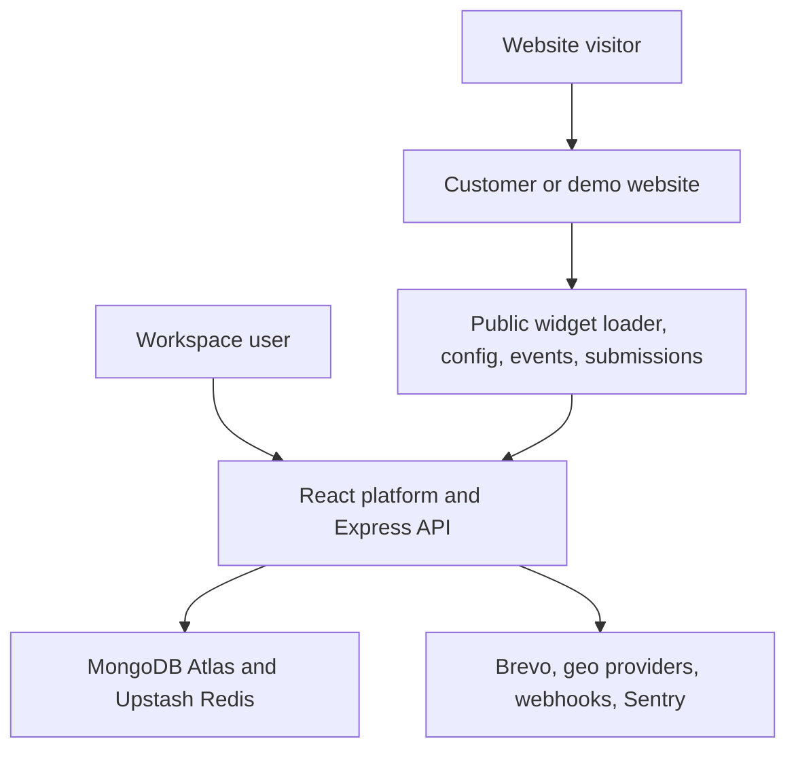
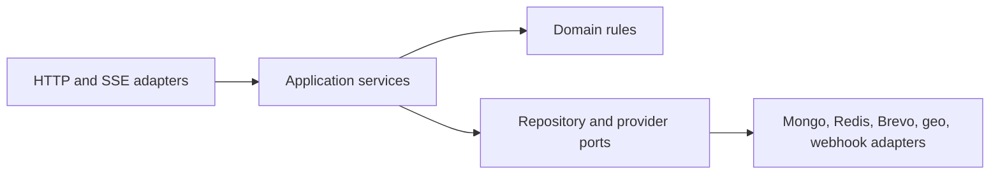

# Embeddable Widget & Lead-Capture Platform

> **Project status: Stage 14 of 16 complete, Stage 15 next. Deployed and live — see §6.**
> Authentication and the multi-workspace user model both work end to end through a real
> accessible interface: onboarding, the workspace switcher, the full role matrix, invitations,
> ownership transfer, and workspace delete/recover. Proven by 125 unit, 110 integration, and 37
> browser end-to-end tests, the last of which include `axe` WCAG 2.2 AA scans on every page.
> Widgets now work end to end too: the three widget types, a settings-form builder with a live
> preview, field schemas, targeting rules, draft/publish revisions, and a copyable embed snippet.
> Published widgets render on a genuinely separate origin, visitors submit through a hardened path,
> the leads land in a role-aware inbox, side effects actually happen — notification and confirmation
> email, signed webhooks, retry with dead-letter and replay — and the widget now records funnel
> events that aggregate into durable daily counters — now read back by eight analytics dashboards
> that update live and never report a rate they cannot compute. Consent, unsubscribe, and the
> data-rights promises are real too: double opt-in, workspace-wide suppression that outlives the
> contact, email-verified export and deletion, and every 30-day recovery window actually firing
> on a schedule. There is now a public face too: a landing page, five documentation guides, the
> four policy pages, and an OpenAPI contract rendered through Swagger UI that is generated from
> the running server and tested against it. And a separate anonymous sandbox on its own origin,
> where anyone can try all three widget types with no account: it stores what you submit, sends
> nothing anywhere, and wipes itself hourly. **All six acceptance probes pass locally.** Proven
> by 347 unit, 312 integration, and 158 browser end-to-end tests. Every command, link, and proof
> marked _planned_ or _TBD_ below does not work today.

---

## 1. What this project is

The platform lets a customer create configurable lead-capture widgets, publish them, and install
them on permitted websites with one script tag. Website visitors can interact with those widgets
and submit leads from external origins. The platform validates and protects every public request,
enriches valid submissions with approximate location data, stores contacts and immutable submission
events, runs non-blocking email and webhook side effects, and presents the results through a
collaborative dashboard and analytics system.

Version 1 is a public, production-like **portfolio demonstration**. Anyone may register, but the
public deployment is intended for synthetic or test data and visibly discloses free-tier
limitations. It is not presented as a service with a commercial uptime or data-durability
guarantee.

### The single success outcome this project is built to prove

A user can register, verify their email, create a workspace and widget, publish it for an allowed
domain, paste one generated script tag into a **separate-origin** website, submit a valid lead, see
that lead appear live in the dashboard, and inspect evidence that validation, tenant isolation,
caching, abuse protection, geo fallback, and failure-safe side effects work correctly.

**Authoritative architecture reference:**
[`Embeddable_Widget_Lead_Capture_Blueprint.md`](./Embeddable_Widget_Lead_Capture_Blueprint.md).
That document is the single source of truth. This README summarizes it and must never contradict
it. A condensed one-page version for evaluators lives at
[`docs/architecture-summary.md`](./docs/architecture-summary.md).

---

## 2. Architecture at a glance

### 2.1 System context and deployment topology



| Component        | Planned production choice                     | Responsibility                                                                                    |
| ---------------- | --------------------------------------------- | ------------------------------------------------------------------------------------------------- |
| Main hosting     | One Render Web Service                        | Express, built React app, widget assets/config, APIs, SSE, and BullMQ workers in the same process |
| Demo hosting     | Separate static site/subdomain                | A real second origin hosting the anonymous live sandbox                                           |
| Database         | MongoDB Atlas free cluster                    | Durable application data                                                                          |
| Redis            | Persistent Upstash Redis                      | Sessions, rate limits, BullMQ, idempotency keys, short caches, SSE fan-out, quota counters        |
| Email            | Brevo                                         | Verification, reset, invitation, privacy, opt-in, confirmation, notification                      |
| Geo enrichment   | ip-api.com, then ipapi.co                     | Primary and fallback IP-to-geo; both may fail without losing a submission                         |
| Error monitoring | Sentry Developer plan                         | Errors and release visibility with PII scrubbing                                                  |
| Source and CI    | One public GitHub repository + GitHub Actions | History, checks, evidence, deployment gate                                                        |

Production is EU-first: Frankfurt for Render and Upstash where available, and the closest available
free EU region for Atlas.

### 2.2 Server layering rule

Every server feature follows the same dependency direction. Routes do not contain tenant queries,
provider logic, or business workflows. Domain and application services do not depend on Express
objects. Provider failures become explicit results rather than leaking transport exceptions into
core logic.



### 2.3 The three request paths

1. **Authenticated management path** — a secure session cookie reaches the same-origin Express API;
   session middleware resolves the user and selected workspace; CSRF protection validates
   state-changing requests; membership and verification gates authorize the action; a
   workspace-scoped application service performs the operation; durable audit and activity records
   are appended; a versioned JSON result returns and relevant live updates emit over SSE.
2. **Widget load path** — a one-line script snippet loads a stable loader (5-minute cache), which
   ensures the content-hashed runtime loads once per page (cached one year, `immutable`). The
   runtime requests the published config with the page Origin and current URL; the backend confirms
   the widget is published, not deleted, within quota, and permitted for that Origin; config
   returns with a 60-second browser cache and an ETag; the runtime evaluates include/exclude
   patterns, trigger rules, and cooldown state, then renders inside Shadow DOM.
3. **Public submission path** — cross-origin request → Origin, size, rate, and widget checks →
   schema, idempotency, honeypot, and timing checks → geo provider A, then B, else continue →
   contact upsert and immutable submission transaction → outbox, SSE signal, generic success →
   BullMQ email and webhook jobs.

The public config contains only renderable settings. It never includes email recipients, webhook
URLs or secrets, internal notes, tenant identifiers, or other private settings. CORS headers are
never treated as authentication — authorization always uses the validated request Origin against
fresh server-owned widget settings.

### 2.4 Data ownership

Every tenant-owned durable record carries `workspaceId`. All repository methods require workspace
scope as an explicit input. The selected workspace comes from authenticated session context, never
from an untrusted request body. Public widget identifiers resolve to one workspace on the server.
Cross-tenant tests are mandatory for every read, update, delete, export, analytics, SSE, trash, and
recovery path.

Durable business truth lives in MongoDB. Sessions, rate counters, public idempotency results, short
caches, live event channels, and fast quota counters live in Redis. Raw IP addresses are never
persisted; a monthly rotating HMAC pseudonym supports short-term abuse analysis without indefinite
visitor linkage.

A **Contact** (unique by normalized email within a workspace, carrying status, assignee, tags, and
notes) is deliberately distinct from an immutable **Submission Event** (the captured field
snapshot, widget revision, domain, page URL, consent snapshot, geo result, and timestamps). Repeat
submissions update the Contact but never rewrite history.

### 2.5 Repository layout

All nine workspaces are implemented as npm workspaces; their boundaries are documented in
[`docs/repository-layout.md`](./docs/repository-layout.md).

| Workspace/path            | Responsibility                                                                       | State                                                                 |
| ------------------------- | ------------------------------------------------------------------------------------ | --------------------------------------------------------------------- |
| `apps/server`             | Express API, static serving, SSE, worker bootstrap                                   | **Populated** — API, jobs, probes, docs, widget and production web    |
| `apps/web`                | React platform, public pages, dashboard                                              | **Populated** — auth, builder, inbox, analytics, privacy, diagnostics |
| `apps/demo`               | Separate-origin anonymous sandbox                                                    | **Populated** — live synthetic widgets, activity feed, reset notice   |
| `packages/contracts`      | Shared TypeScript contracts and validation schemas                                   | **Populated** — errors, pagination, validation, concurrency, logging  |
| `packages/database`       | Mongo models, repositories, indexes, migrations                                      | **Populated** — connection, migrations, tenancy-scoped repositories   |
| `packages/widget-runtime` | Framework-free TypeScript loader/runtime build                                       | **Populated** — loader, shadow-DOM runtime, forms and triggers        |
| `packages/ui`             | Shared accessible React components and design tokens                                 | **Populated** — accessible components and design system               |
| `packages/config`         | Shared lint, TypeScript, test, and build configuration                               | **Populated** — consumed by every workspace                           |
| `packages/test-utils`     | Fixtures, provider fakes, tenant helpers                                             | **Populated** — two-tenant and isolated-database fixtures             |
| `docs`                    | Architecture decisions and operational runbooks                                      | Populated                                                             |
| Repository root           | README, capstone manifest, evidence/build logs, env example, license, Docker Compose | Populated                                                             |

---

## 3. Known submission risk: this repository is technically a monorepo

This disclosure is deliberate and is not softened.

The capstone brief requires the project to live in one dedicated repository, and separately warns
against building it as a monorepo. This project's locked decision is to organize that one
repository with **npm workspaces**, which is technically a monorepo. The decision is preserved
because every workspace belongs to this one application — there is no second product, no library
published elsewhere, and no unrelated code in the tree. It is an intentional full-stack expansion,
not an accident of tooling.

**If an evaluator interprets "no monorepo" literally, this is a known submission risk.**

The risk is mitigated, not eliminated: there is one dedicated public repository, the
evaluator-facing files (`README.md`, `capstone.yaml`, `EVIDENCE.md`, `BUILDLOG.md`, `.env.example`,
`LICENSE`) stay at the repository root, and the project preserves a single documented command to
run everything. The same disclosure appears in
[`docs/architecture-summary.md`](./docs/architecture-summary.md).

---

## 4. Explicit version 1 non-goals

The following are intentionally excluded. Do not assume any of them are planned, partially built,
or arriving later in version 1:

- billing, subscriptions, paid plans, or payment processing;
- customer API keys or external access to management and lead APIs;
- social login, enterprise SSO, or mandatory MFA;
- arbitrary custom widget types — there are exactly three: contact form, email signup form, and CTA
  popover;
- arbitrary customer JavaScript, custom CSS, or unrestricted HTML templates;
- file-upload fields or attachment storage;
- a full email-marketing campaign engine;
- CRM automation beyond statuses, assignments, notes, tags, notifications, and webhooks;
- domain-ownership verification;
- a real CDN, custom domain, paid always-on worker, staging environment, or formal SLA;
- real customer data in the hosted portfolio demo;
- a mobile application;
- legacy-browser support.

These non-goals keep the system complete and demonstrable without allowing the expanded scope to
bury the capstone's core backend requirements.

---

## 5. Running the project locally

Everything below is **verified working**. You need only [Docker](https://docs.docker.com/get-docker/)
and [Node.js 22+](https://nodejs.org/). You do **not** need Brevo, MongoDB Atlas, Upstash, Render, or
geo-provider credentials — there is nothing to sign up for.

### 5.1 Start everything with one command

```bash
docker compose up --build
```

That brings up all six services:

| Service              | URL                   | Purpose                                          |
| -------------------- | --------------------- | ------------------------------------------------ |
| Server (Express API) | http://localhost:3000 | API and health endpoints                         |
| Web (React platform) | http://localhost:5173 | Platform application shell                       |
| Demo sandbox         | http://localhost:5174 | **A genuinely separate origin** from the web app |
| MongoDB              | `localhost:27017`     | Single-member replica set, so transactions work  |
| Redis                | `localhost:6379`      | Sessions, rate limits, queues, and delayed jobs  |
| Mailpit              | http://localhost:8025 | Local email inbox (SMTP on 1025)                 |

Check that the stack is healthy:

```bash
curl http://localhost:3000/health/live     # {"status":"ok",...}
curl http://localhost:3000/health/ready    # MongoDB, Redis, and migration compatibility
```

Stop with `docker compose down`, or `docker compose down -v` to also discard the database volumes.

### 5.2 Seed

```bash
npm ci        # once, on the host
npm run seed
```

The seed command applies migrations and then resets and reseeds only the explicitly synthetic
`DemoService` workspace. It never creates or edits an ordinary workspace.

### 5.3 Quality commands

Run these on the host after `npm ci`:

| Command                    | What it does                                                                                                                                                                                    | Status |
| -------------------------- | ----------------------------------------------------------------------------------------------------------------------------------------------------------------------------------------------- | ------ |
| `npm run lint`             | ESLint across every workspace                                                                                                                                                                   | Real   |
| `npm run format:check`     | Prettier formatting check                                                                                                                                                                       | Real   |
| `npm run typecheck`        | Strict TypeScript across all nine workspaces                                                                                                                                                    | Real   |
| `npm run test`             | Unit tests, no infrastructure needed (385 tests, incl. the role matrix, widget rules, and the CSP)                                                                                              | Real   |
| `npm run test:integration` | Tenancy, auth, RBAC, widgets, submissions, inbox, delivery, analytics, privacy, the API contract, security headers, diagnostics, and the sandbox against real MongoDB/Redis/Mailpit (328 tests) | Real   |
| `npm run test:e2e`         | Browser journeys, axe accessibility checks, and Content Security Policy verification, driven through the real UI                                                                                | Real   |
| `npm run scan:secrets`     | Scan every tracked file for credential shapes; the same check CI runs                                                                                                                           | Real   |
| `npm run migrate`          | Apply committed migrations and indexes; repeatable                                                                                                                                              | Real   |
| `npm run build`            | Production build of every workspace                                                                                                                                                             | Real   |

### 5.3a Where to look once it is running

| Surface                             | URL                                         |
| ----------------------------------- | ------------------------------------------- |
| Landing page                        | <http://localhost:5173/>                    |
| Installation and configuration docs | <http://localhost:5173/docs/install>        |
| API reference (Swagger UI)          | <http://localhost:5173/api-reference>       |
| The OpenAPI document itself         | <http://localhost:5173/api/v1/openapi.json> |
| Policies                            | <http://localhost:5173/policies/privacy>    |
| See or delete your own data         | <http://localhost:5173/privacy>             |
| The public sandbox                  | <http://localhost:5174/>                    |
| Liveness and readiness              | <http://localhost:3000/health/ready>        |

All of these are public: none needs an account, and a browser test asserts that by clearing cookies
before visiting every one of them.

One surface is deliberately not public. `GET /api/v1/diagnostics` is the platform-operator view of
blueprint 16.4 - queue depths, dead letters, the daily email budget, migration state, the last
retention sweep. It is restricted to an allowlist of addresses in `PLATFORM_OPERATOR_EMAILS`, matched
against the signed-in user, and is closed to everybody when that list is empty, which is the default.
A caller who is not on it gets 404 rather than 403, so the endpoint cannot be confirmed to exist.

Every response the platform sends carries security headers and a Content Security Policy
(`docs/secret-rotation.md` has the deployment note on the three headers a static host must send
itself). The sandbox on 5174 carries the strictest policy in the product - no inline scripts and no
inline styles - which is what proves the widget runtime can be installed on a customer's site
without that site weakening its own policy.

`npm run test:integration` and `npm run test:e2e` need MongoDB, Redis, and Mailpit
running. Start them with `docker compose up -d --wait mongo redis mailpit`, or the full
stack with `docker compose up --build`. Playwright starts the API and web servers itself.

### 5.4 Known issue: repository path must not contain `&`

On Windows, npm runs lifecycle scripts through `cmd.exe`, which treats `&` in a directory path as a
command separator. If the repository is checked out to a path containing an ampersand, `npm run`
fails with `'...' is not recognized as an internal or external command`. A normal `git clone` gives a
path with no ampersand, so this affects only manually named local folders. Clone or rename to a path
without `&`.

## 6. Deployment links

> **Deployed and verified on 2026-09-18** from release `91766bc`. One Render Free Web Service in
> Frankfurt serves React, the API, the widget, SSE, and the worker; a separate free Render Static
> Site serves the sandbox on its own origin. MongoDB Atlas, Upstash Redis, Brevo, and Sentry are all
> free-tier. Smoke, cross-origin, auth, queue, encrypted restore, and the cold-start/delayed-queue
> rehearsal all have recorded results in [`EVIDENCE.md`](./EVIDENCE.md).

| Surface                        | URL                                                                              | Status |
| ------------------------------ | -------------------------------------------------------------------------------- | ------ |
| Platform (React app + API)     | [lead-capture-platform.onrender.com](https://lead-capture-platform.onrender.com) | Live   |
| Separate-origin live demo      | [lead-capture-demo.onrender.com](https://lead-capture-demo.onrender.com)         | Live   |
| API documentation (Swagger UI) | [/api-reference](https://lead-capture-platform.onrender.com/api-reference)       | Live   |
| Health and readiness probes    | [/health/ready](https://lead-capture-platform.onrender.com/health/ready)         | Live   |

The free web service sleeps after 15 minutes without traffic. A measured cold wake took **33.4
seconds**; the first request after an idle period is slow and then the service is normal. No
keep-awake traffic is used. The hosted data is synthetic and there is no SLA — see §7.

Provider credentials are entered in provider dashboards and never committed: Atlas and Upstash
connection strings, a verified Brevo sender and API key, and a Sentry DSN. Anyone redeploying this
repository needs their own.

---

## 7. Limitations

Two kinds of limitation apply. The first is permanent and by design; the second is temporary and
reflects that Stage 14 still needs a credentialed live deployment and recovery rehearsal.

### 7.1 Permanent, by-design limitations of version 1

- The hosted deployment is a **synthetic-data portfolio demo with no SLA**, and no commercial
  uptime or data-durability guarantee.
- The Render Web Service may sleep after inactivity. Background jobs stay persisted in Upstash and
  resume when the service wakes; pending or delayed delivery states are shown honestly rather than
  hidden. The system does not use artificial keep-awake traffic.
- MongoDB Atlas free-tier backup and availability limitations apply. There is no automated cloud
  backup in version 1 — the repository documents encrypted export/restore procedures and ships
  reproducible seed data instead.
- Brevo allows 300 messages per day. 100 are reserved for authentication and privacy-critical
  flows, at most 200 are used for visitor confirmation and workspace notification side effects, and
  excess non-critical email stays queued until the next provider allowance window. Public sandbox
  email is disabled so it cannot consume the allowance.
- Per-workspace hard limits in the public demo: 10 active widgets, 10 total users including the
  Owner, 2,000 accepted submissions per workspace month, and 20,000 interaction events per
  workspace month.
- Exit intent is desktop-capable behavior. Where it cannot be meaningfully detected the widget does
  not fake the trigger, though another configured trigger may still open it.
- Everything listed in §4 above is out of scope.
- The repository is organized as an npm-workspaces monorepo — see §3.

### 7.2 Current limitations (temporary)

Rewritten in Stage 13. It had been describing the repository as of Stage 9 — claiming the widget's
form did not post, that no interaction events were recorded, that there was no dashboard chrome, and
that every acceptance probe was unproven. All four had been false for several stages. A limitations
section that understates what works is as misleading as one that overstates it, and it is worse for
a reader trying to decide what to trust.

**Providers and delivery**

- **Brevo has never been exercised for real.** Every email in every test goes to Mailpit. The
  adapter's failure classification is unit-tested, but no message has gone through the actual
  provider, and the free tier's 300 a day is a real constraint a busy demo would hit.
- **The operator alert only writes a log.** A new dead letter emits a structured
  `delivery.dead_letter_alert` record; a pager or email integration attaches at that one call site
  and does not exist yet.
- **SSRF validation is check-then-connect.** Every resolved address is checked immediately before
  each request, but a DNS entry that changes between the check and the connection is not caught.
  Closing that properly means pinning the connection to the validated address, which Node's `fetch`
  does not expose; the port allowlist limits what a won race could reach.
- Geo enrichment is off outside production. ip-api's free endpoint allows 45 requests a minute per
  source address and excludes commercial use, so `GEO_ENABLED` defaults to false and the test suite
  drives scripted providers instead.
- **Blueprint 12.1 lists nine queue families and this codebase has eight.** Authentication and
  privacy email was never given a queue, so those messages are sent inline inside the request: a
  provider hiccup during registration surfaces as a failed registration rather than a retried email.

**Scheduling and background work**

- Every scheduled sweep — reconciliation, analytics aggregation, retention, and the hourly sandbox
  reset — runs as a BullMQ job scheduler only when the worker is started in-process. The tests drive
  each sweep directly, so nothing proves the schedule itself fires; only that the sweep does the
  right thing when it does.
- The runtime bundle is read from disk once when the server starts, so a rebuilt widget runtime needs
  a server restart before the new content hash is served.

**Live updates**

- The SSE reconnect replay buffer is process-local and holds 50 events per workspace, which is right
  for the single web process version 1 deploys and would need to move into Redis for a second.
- Membership revocation closes an open stream within one 25-second heartbeat rather than instantly.
- The public sandbox polls its activity feed rather than receiving it. The SSE stream is
  authenticated and workspace-scoped, and opening it to an anonymous page would be a second, weaker
  path into a live stream.

**Security and operations**

- **`IP_HMAC_SECRET` cannot be rotated without breaking every outstanding unsubscribe link.** It is
  the master secret for four derived key families, including the signature on every consent link ever
  emailed. `docs/secret-rotation.md` documents the consequence and the procedure; splitting it into
  two secrets would fix it and is a data-format change rather than a hardening one.
- **Retiring an encryption key is a manual step.** There is no bulk re-encryption command: each
  webhook signing secret must be re-saved and each MFA enrolment redone. Version 1 has few enough of
  these that doing it deliberately is safer than a migration nobody has run.
- **The dashboard's browser tests exercise a development Content Security Policy**, which allows an
  inline script and a WebSocket that the built application does not. The strict production policy is
  asserted by a unit test and was verified by hand in a browser; the sandbox, which is tested built,
  proves the strict case end to end.
- **A static host must send three headers itself.** A `<meta>` policy cannot carry `frame-ancestors`,
  `Permissions-Policy`, or `Strict-Transport-Security`. The dev and preview servers send them and
  Express sends them for everything it serves; Stage 14 owns configuring the host that serves the two
  front-end applications.
- Automated accessibility scanning catches roughly a third of real problems. Every critical page and
  the widget itself are clean at critical and serious severity against the WCAG 2.2 AA rule set, and
  keyboard operation is tested separately — but nobody has used this product with a screen reader.
- The builder does not warn when a creator picks a low-contrast colour pairing. Both the preview and
  the real widget render it faithfully, including its poor contrast.

**Deployment**

- **Browser-side error monitoring does not work in production.** `VITE_SENTRY_DSN` is set on the
  service, but the dashboard's Content Security Policy allows `connect-src 'self'` only, so every
  Sentry request from the browser is blocked. Readiness still reports error monitoring as up,
  because the server probe only checks that a DSN is configured. Server-side Sentry is unaffected.
  Open, with two candidate fixes recorded in `EVIDENCE.md`.
- **A provider failure is hard to diagnose from the logs.** The Brevo sender computes an HTTP status
  for a failed send but logs only `outcome: failed`, and the backup scripts end in a catch-all that
  prints one generic sentence. During Stage 14 this masked six distinct failures — two email, four
  backup — each of which needed a separate throwaway diagnostic to identify. Suppressing the
  message is deliberate, because a driver error can echo a URI with its password; suppressing the
  error's class and code is not.
- **The deployed service became unreachable once**, for roughly six minutes on 2026-09-18, and
  recovered only after a manual redeploy. The root cause was not established. There is no automatic
  recovery for this on a free instance.
- Render's Free Web Service sleeps after 15 minutes; a measured cold wake took 33.4 seconds. Release
  migration/seed runs once in each deploy build because Render's dedicated pre-deploy command is a
  paid-service feature; both operations are repeatable and the seed touches only the synthetic
  sandbox, so a cold wake cannot mask the delayed-queue check by reseeding it.
- Upstash's current free allowance is 500,000 commands per month. The deployment leaves eviction
  disabled so capacity is a visible failure rather than silent loss of sessions or queued work.
- The repository path must not contain `&` on Windows — see §5.4.

_This section is expanded honestly as stages complete, and finalized in Stage 15._

---

## 8. Evidence

[`EVIDENCE.md`](./EVIDENCE.md) maps every capstone requirement and acceptance probe to a repeatable
proof, with the command that produces it and its actual output.

**All six mandatory acceptance probes pass**, and each names the test that runs it:

| Probe                          | Required proof                                                          | Proven by                                                               |
| ------------------------------ | ----------------------------------------------------------------------- | ----------------------------------------------------------------------- |
| Valid second-origin submission | 2xx, durable Submission Event, visible Contact/dashboard result         | `submission.integration.test.ts` PROBE 1                                |
| Malformed and oversized input  | Clean 4xx JSON errors, never 500                                        | `submission.integration.test.ts` PROBE 2                                |
| Burst traffic                  | 429 responses appear while a later legitimate request still succeeds    | `submission.integration.test.ts` PROBE 3                                |
| Geo fallback                   | A down → B enriches; A and B down → submission still stored without geo | `submission.integration.test.ts` PROBE 4                                |
| Side-effect failure            | Email/webhook throws, primary submission remains successful and stored  | `submission.integration.test.ts` PROBE 5, `delivery.integration` GATE 1 |
| Honeypot                       | Bot-like submission receives a generic outcome but creates no Contact   | `submission.integration.test.ts` PROBE 6                                |

The blueprint §17 security checklist is audited item by item in `EVIDENCE.md` Part C: every one of
its nineteen requirements names the code that enforces it and the named test that proves it.

---

## 9. Repository map

| Path                                                                                           | Purpose                                                       | Status                                           |
| ---------------------------------------------------------------------------------------------- | ------------------------------------------------------------- | ------------------------------------------------ |
| [`Embeddable_Widget_Lead_Capture_Blueprint.md`](./Embeddable_Widget_Lead_Capture_Blueprint.md) | Authoritative architecture and 16-stage plan                  | Complete                                         |
| [`README.md`](./README.md)                                                                     | This file — orientation for a stranger                        | Stage 1                                          |
| [`docs/architecture-summary.md`](./docs/architecture-summary.md)                               | One-page evaluator summary                                    | Current                                          |
| [`docs/repository-layout.md`](./docs/repository-layout.md)                                     | Workspace ownership map                                       | Current                                          |
| [`docs/stage-checklist.md`](./docs/stage-checklist.md)                                         | All 16 stages, goals, and exit gates                          | Stages 0–13 checked                              |
| [`docs/secret-rotation.md`](./docs/secret-rotation.md)                                         | How to rotate every key without destroying data               | Stage 13                                         |
| [`docs/deployment-recovery.md`](./docs/deployment-recovery.md)                                 | Free-tier deployment, live gates, encrypted restore rehearsal | Stage 14 prepared; live results pending          |
| [`EVIDENCE.md`](./EVIDENCE.md)                                                                 | One proof per requirement                                     | All six probes passing; §17 audited item by item |
| [`BUILDLOG.md`](./BUILDLOG.md)                                                                 | Where AI helped, failed, and was corrected                    | Stages 0–13 recorded                             |
| [`capstone.yaml`](./capstone.yaml)                                                             | Machine-readable run/seed/test/probe manifest                 | Real commands; production URLs `TBD`             |
| [`scripts/scan-secrets.mjs`](./scripts/scan-secrets.mjs)                                       | Credential scan, run locally and in CI                        | Stage 13                                         |
| [`render.yaml`](./render.yaml)                                                                 | Render Web Service and separate static demo Blueprint         | Stage 14                                         |
| `scripts/backup-*.mjs`                                                                         | Authenticated encrypted export and guarded restore rehearsal  | Stage 14                                         |
| [`.env.example`](./.env.example)                                                               | Safe placeholder configuration                                | Placeholders only, no secrets                    |
| [`.gitignore`](./.gitignore)                                                                   | Established before dependencies or secrets could be committed | Current                                          |
| [`LICENSE`](./LICENSE)                                                                         | MIT                                                           | Complete                                         |
| [`package.json`](./package.json)                                                               | npm workspaces root and quality scripts                       | Stage 1                                          |
| [`docker-compose.yml`](./docker-compose.yml)                                                   | Local six-service topology                                    | Stage 1                                          |
| [`Dockerfile.dev`](./Dockerfile.dev)                                                           | Shared development image for the three apps                   | Stage 1                                          |
| [`.github/workflows/ci.yml`](./.github/workflows/ci.yml)                                       | CI baseline                                                   | Stage 1                                          |
| `apps/`, `packages/`                                                                           | The nine npm workspaces                                       | See §2.5                                         |

---

## 10. Implementation plan

The project is built in 16 bounded stages, each with an explicit exit gate. Stage 0 (this one)
establishes the repository contract and design pack before any feature code. See
[`docs/stage-checklist.md`](./docs/stage-checklist.md) for the full list, and blueprint §19 for
each stage's deliverables in detail.

The capstone brief's own phases map onto those stages as follows:

| Brief phase                              | Implementation stages                                   |
| ---------------------------------------- | ------------------------------------------------------- |
| Phase 1 — Design                         | Stages 0–2                                              |
| Phase 2 — Hardened submission path       | Stages 3–7, with side-effect proof completed in Stage 9 |
| Phase 3 — Delivery, dashboard, and proof | Stages 6 and 8–15                                       |

The expanded sequence is longer than the original brief because this project includes a complete
React product, collaborative workspaces, consent and privacy workflows, real-time analytics, and
public deployment. The original acceptance probes remain mandatory gates and are never deferred
behind optional polish.

---

## 11. License

[MIT](./LICENSE).
