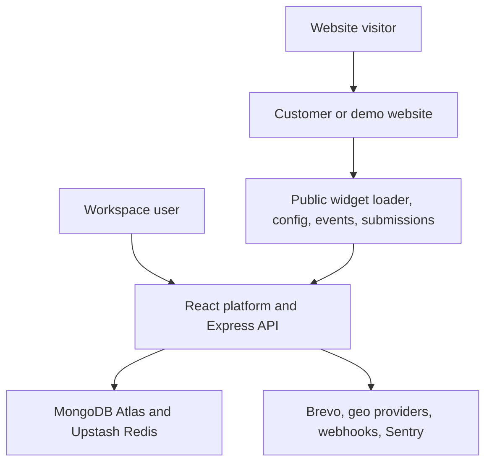
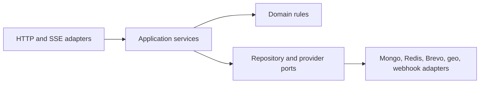

# Embeddable Widget & Lead-Capture Platform

> **Project status: Stage 0 of 16 complete — repository contract and design pack only.**
> No application code exists yet. Every command, link, and proof in this README that is marked
> *planned* or *TBD* does not work today. Nothing here should be read as a working feature.

---

## 1. What this project is

The platform lets a customer create configurable lead-capture widgets, publish them, and install
them on permitted websites with one script tag. Website visitors can interact with those widgets
and submit leads from external origins. The platform validates and protects every public request,
enriches valid submissions with approximate location data, stores contacts and immutable submission
events, runs non-blocking email and webhook side effects, and presents the results through a
collaborative dashboard and analytics system.

Version 1 is a public, production-like **portfolio demonstration**. Anyone may register, but the
public deployment is intended for synthetic or test data and visibly discloses free-tier
limitations. It is not presented as a service with a commercial uptime or data-durability
guarantee.

### The single success outcome this project is built to prove

A user can register, verify their email, create a workspace and widget, publish it for an allowed
domain, paste one generated script tag into a **separate-origin** website, submit a valid lead, see
that lead appear live in the dashboard, and inspect evidence that validation, tenant isolation,
caching, abuse protection, geo fallback, and failure-safe side effects work correctly.

**Authoritative architecture reference:**
[`Embeddable_Widget_Lead_Capture_Blueprint.md`](./Embeddable_Widget_Lead_Capture_Blueprint.md).
That document is the single source of truth. This README summarizes it and must never contradict
it. A condensed one-page version for evaluators lives at
[`docs/architecture-summary.md`](./docs/architecture-summary.md).

---

## 2. Architecture at a glance

### 2.1 System context and deployment topology

| Component | Planned production choice | Responsibility |
| --- | --- | --- |
| Main hosting | One Render Web Service | Express, built React app, widget assets/config, APIs, SSE, and BullMQ workers in the same process |
| Demo hosting | Separate static site/subdomain | A real second origin hosting the anonymous live sandbox |
| Database | MongoDB Atlas free cluster | Durable application data |
| Redis | Persistent Upstash Redis | Sessions, rate limits, BullMQ, idempotency keys, short caches, SSE fan-out, quota counters |
| Email | Brevo | Verification, reset, invitation, privacy, opt-in, confirmation, notification |
| Geo enrichment | ip-api.com, then ipapi.co | Primary and fallback IP-to-geo; both may fail without losing a submission |
| Error monitoring | Sentry Developer plan | Errors and release visibility with PII scrubbing |
| Source and CI | One public GitHub repository + GitHub Actions | History, checks, evidence, deployment gate |

Production is EU-first: Frankfurt for Render and Upstash where available, and the closest available
free EU region for Atlas.

### 2.2 Server layering rule

Every server feature follows the same dependency direction. Routes do not contain tenant queries,
provider logic, or business workflows. Domain and application services do not depend on Express
objects. Provider failures become explicit results rather than leaking transport exceptions into
core logic.

### 2.3 The three request paths

1. **Authenticated management path** — a secure session cookie reaches the same-origin Express API;
   session middleware resolves the user and selected workspace; CSRF protection validates
   state-changing requests; membership and verification gates authorize the action; a
   workspace-scoped application service performs the operation; durable audit and activity records
   are appended; a versioned JSON result returns and relevant live updates emit over SSE.
2. **Widget load path** — a one-line script snippet loads a stable loader (5-minute cache), which
   ensures the content-hashed runtime loads once per page (cached one year, `immutable`). The
   runtime requests the published config with the page Origin and current URL; the backend confirms
   the widget is published, not deleted, within quota, and permitted for that Origin; config
   returns with a 60-second browser cache and an ETag; the runtime evaluates include/exclude
   patterns, trigger rules, and cooldown state, then renders inside Shadow DOM.
3. **Public submission path** — cross-origin request → Origin, size, rate, and widget checks →
   schema, idempotency, honeypot, and timing checks → geo provider A, then B, else continue →
   contact upsert and immutable submission transaction → outbox, SSE signal, generic success →
   BullMQ email and webhook jobs.

The public config contains only renderable settings. It never includes email recipients, webhook
URLs or secrets, internal notes, tenant identifiers, or other private settings. CORS headers are
never treated as authentication — authorization always uses the validated request Origin against
fresh server-owned widget settings.

### 2.4 Data ownership

Every tenant-owned durable record carries `workspaceId`. All repository methods require workspace
scope as an explicit input. The selected workspace comes from authenticated session context, never
from an untrusted request body. Public widget identifiers resolve to one workspace on the server.
Cross-tenant tests are mandatory for every read, update, delete, export, analytics, SSE, trash, and
recovery path.

Durable business truth lives in MongoDB. Sessions, rate counters, public idempotency results, short
caches, live event channels, and fast quota counters live in Redis. Raw IP addresses are never
persisted; a monthly rotating HMAC pseudonym supports short-term abuse analysis without indefinite
visitor linkage.

A **Contact** (unique by normalized email within a workspace, carrying status, assignee, tags, and
notes) is deliberately distinct from an immutable **Submission Event** (the captured field
snapshot, widget revision, domain, page URL, consent snapshot, geo result, and timestamps). Repeat
submissions update the Contact but never rewrite history.

### 2.5 Planned repository layout

This is a conceptual ownership map. **These directories do not exist yet** — Stage 1 creates the
workspaces and their tooling. See [`docs/repository-layout.md`](./docs/repository-layout.md) for
the full table and for why Stage 0 documents the layout instead of manufacturing empty folders.

| Workspace/path | Responsibility | Created in |
| --- | --- | --- |
| `apps/server` | Express API, static serving, SSE, worker bootstrap | Stage 1 |
| `apps/web` | React platform, public pages, dashboard | Stage 1 |
| `apps/demo` | Separate-origin anonymous sandbox | Stage 1 |
| `packages/contracts` | Shared TypeScript contracts and validation schemas | Stage 2 |
| `packages/database` | Mongo models, repositories, indexes, migrations | Stage 2 |
| `packages/widget-runtime` | Framework-free TypeScript loader/runtime build | Stage 6 |
| `packages/ui` | Shared accessible React components and design tokens | Stage 1 |
| `packages/config` | Shared lint, TypeScript, test, and build configuration | Stage 1 |
| `packages/test-utils` | Fixtures, provider fakes, tenant helpers | Stage 1 |
| `docs` | Architecture decisions and operational runbooks | **Stage 0 — exists now** |
| Repository root | README, capstone manifest, evidence/build logs, env example, license, Docker Compose | **Stage 0 — partially exists now** |

---

## 3. Known submission risk: this repository is technically a monorepo

This disclosure is deliberate and is not softened.

The capstone brief requires the project to live in one dedicated repository, and separately warns
against building it as a monorepo. This project's locked decision is to organize that one
repository with **npm workspaces**, which is technically a monorepo. The decision is preserved
because every workspace belongs to this one application — there is no second product, no library
published elsewhere, and no unrelated code in the tree. It is an intentional full-stack expansion,
not an accident of tooling.

**If an evaluator interprets "no monorepo" literally, this is a known submission risk.**

The risk is mitigated, not eliminated: there is one dedicated public repository, the
evaluator-facing files (`README.md`, `capstone.yaml`, `EVIDENCE.md`, `BUILDLOG.md`, `.env.example`,
`LICENSE`) stay at the repository root, and the project preserves a single documented command to
run everything. The same disclosure appears in
[`docs/architecture-summary.md`](./docs/architecture-summary.md).

---

## 4. Explicit version 1 non-goals

The following are intentionally excluded. Do not assume any of them are planned, partially built,
or arriving later in version 1:

- billing, subscriptions, paid plans, or payment processing;
- customer API keys or external access to management and lead APIs;
- social login, enterprise SSO, or mandatory MFA;
- arbitrary custom widget types — there are exactly three: contact form, email signup form, and CTA
  popover;
- arbitrary customer JavaScript, custom CSS, or unrestricted HTML templates;
- file-upload fields or attachment storage;
- a full email-marketing campaign engine;
- CRM automation beyond statuses, assignments, notes, tags, notifications, and webhooks;
- domain-ownership verification;
- a real CDN, custom domain, paid always-on worker, staging environment, or formal SLA;
- real customer data in the hosted portfolio demo;
- a mobile application;
- legacy-browser support.

These non-goals keep the system complete and demonstrable without allowing the expanded scope to
bury the capstone's core backend requirements.

---

## 5. Running the project locally

> **Not available yet.** *To be completed in Stage 1 (workspace tooling, local infrastructure, and
> CI baseline), then finalized in Stage 15.* No `package.json`, no Docker Compose file, and no
> scripts exist in this repository today. Do not attempt the commands below — the table describes
> the planned shape of the interface, not working commands.

Planned contract, per blueprint §15.1: one documented Docker Compose command plus one seed step must
bring up the application/server services, the React development and build path, the separate-origin
demo site, MongoDB configured to support the transaction behavior the app uses, Redis, and Mailpit
for local email inspection. No developer will need Brevo, Atlas, Upstash, or Render credentials for
normal local development; provider adapters support deterministic fakes.

| Step | Planned command | Filled in by |
| --- | --- | --- |
| Install | *TBD* | Stage 1 |
| Start dependencies and apps | *TBD* | Stage 1 |
| Seed reproducible demo data | *TBD* | Stage 1, extended per feature stage |
| Run tests | *TBD* | Stage 1, extended per feature stage |
| Run acceptance probes | *TBD* | Stage 7 |

The machine-readable version of this table is [`capstone.yaml`](./capstone.yaml), which currently
holds `TBD` values for exactly the same reason.

---

## 6. Deployment links

> **Not available yet.** *To be completed in Stage 14 (production-demo deployment and recovery
> rehearsal).* Nothing is deployed. No URLs exist.

| Surface | URL | Filled in by |
| --- | --- | --- |
| Platform (React app + API) | *Not deployed* | Stage 14 |
| Separate-origin live demo | *Not deployed* | Stage 14 |
| API documentation (Swagger UI) | *Not deployed* | Built in Stage 12, deployed in Stage 14 |
| Health and readiness probes | *Not deployed* | Stage 14 |

---

## 7. Limitations

Two kinds of limitation apply. The first is permanent and by design; the second is temporary and
reflects that this repository is only at Stage 0.

### 7.1 Permanent, by-design limitations of version 1

- The hosted deployment is a **synthetic-data portfolio demo with no SLA**, and no commercial
  uptime or data-durability guarantee.
- The Render Web Service may sleep after inactivity. Background jobs stay persisted in Upstash and
  resume when the service wakes; pending or delayed delivery states are shown honestly rather than
  hidden. The system does not use artificial keep-awake traffic.
- MongoDB Atlas free-tier backup and availability limitations apply. There is no automated cloud
  backup in version 1 — the repository documents encrypted export/restore procedures and ships
  reproducible seed data instead.
- Brevo allows 300 messages per day. 100 are reserved for authentication and privacy-critical
  flows, at most 200 are used for visitor confirmation and workspace notification side effects, and
  excess non-critical email stays queued until the next provider allowance window. Public sandbox
  email is disabled so it cannot consume the allowance.
- Per-workspace hard limits in the public demo: 10 active widgets, 10 total users including the
  Owner, 2,000 accepted submissions per workspace month, and 20,000 interaction events per
  workspace month.
- Exit intent is desktop-capable behavior. Where it cannot be meaningfully detected the widget does
  not fake the trigger, though another configured trigger may still open it.
- Everything listed in §4 above is out of scope.
- The repository is organized as an npm-workspaces monorepo — see §3.

### 7.2 Stage 0 limitations (temporary)

- There is no application code, no tooling, no dependencies, no tests, no CI, and no deployment.
- Every acceptance probe in [`EVIDENCE.md`](./EVIDENCE.md) is unproven and explicitly marked so.
- `capstone.yaml` contains `TBD` placeholders rather than commands.
- *This section is expanded honestly as stages complete, and finalized in Stage 15.*

---

## 8. Evidence

> **No proofs exist yet.** *To be completed progressively; the submission-path probes land in
> Stage 7 and the evidence pack is finalized in Stage 15.*

[`EVIDENCE.md`](./EVIDENCE.md) maps every capstone requirement and acceptance probe to a repeatable
proof. Today every entry is marked *Not yet implemented*, with the stage that will deliver it. No
entry is marked complete and no test output is quoted, because no test has been written or run.

The six acceptance probes that must eventually pass are:

| Probe | Required proof | Planned stage |
| --- | --- | --- |
| Valid second-origin submission | 2xx, durable Submission Event, visible Contact/dashboard result | Stage 7 |
| Malformed and oversized input | Clean 4xx JSON errors, never 500 | Stage 7 |
| Burst traffic | 429 responses appear while a later legitimate request still succeeds | Stage 7 |
| Geo fallback | A down → B enriches; A and B down → submission still stored without geo | Stage 7 |
| Side-effect failure | Email/webhook throws, primary submission remains successful and stored | Stage 7, completed in Stage 9 |
| Honeypot | Bot-like submission receives a generic outcome but creates no Contact | Stage 7 |

---

## 9. Repository map

| File | Purpose | Status |
| --- | --- | --- |
| [`Embeddable_Widget_Lead_Capture_Blueprint.md`](./Embeddable_Widget_Lead_Capture_Blueprint.md) | Authoritative architecture and 16-stage plan | Complete |
| [`README.md`](./README.md) | This file — orientation for a stranger | Stage 0 skeleton |
| [`docs/architecture-summary.md`](./docs/architecture-summary.md) | One-page evaluator summary | Complete for Stage 0 |
| [`docs/repository-layout.md`](./docs/repository-layout.md) | Conceptual workspace ownership map | Complete for Stage 0 |
| [`docs/stage-checklist.md`](./docs/stage-checklist.md) | All 16 stages, goals, and exit gates | Stage 0 checked, 1–15 open |
| [`EVIDENCE.md`](./EVIDENCE.md) | One proof per requirement | Skeleton, all entries unproven |
| [`BUILDLOG.md`](./BUILDLOG.md) | Where AI helped, failed, and was corrected | Stage 0 entry recorded |
| [`capstone.yaml`](./capstone.yaml) | Machine-readable run/seed/test/probe manifest | Skeleton, `TBD` values |
| [`.env.example`](./.env.example) | Safe placeholder configuration | Placeholders only, no secrets |
| [`.gitignore`](./.gitignore) | Established before dependencies or secrets could be committed | Complete |
| [`LICENSE`](./LICENSE) | MIT | Complete |

---

## 10. Implementation plan

The project is built in 16 bounded stages, each with an explicit exit gate. Stage 0 (this one)
establishes the repository contract and design pack before any feature code. See
[`docs/stage-checklist.md`](./docs/stage-checklist.md) for the full list, and blueprint §19 for
each stage's deliverables in detail.

The capstone brief's own phases map onto those stages as follows:

| Brief phase | Implementation stages |
| --- | --- |
| Phase 1 — Design | Stages 0–2 |
| Phase 2 — Hardened submission path | Stages 3–7, with side-effect proof completed in Stage 9 |
| Phase 3 — Delivery, dashboard, and proof | Stages 6 and 8–15 |

The expanded sequence is longer than the original brief because this project includes a complete
React product, collaborative workspaces, consent and privacy workflows, real-time analytics, and
public deployment. The original acceptance probes remain mandatory gates and are never deferred
behind optional polish.

---

## 11. License

[MIT](./LICENSE).
