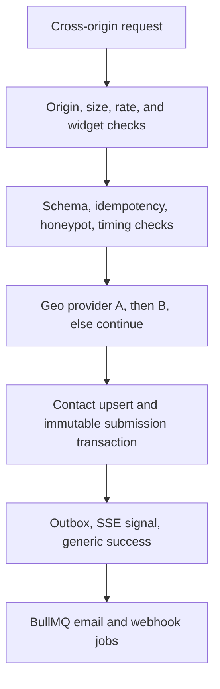
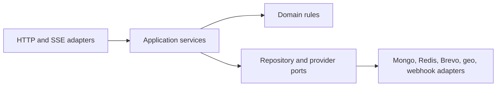

# Architecture summary — one page for evaluators

**This is a condensed summary of
[`../Embeddable_Widget_Lead_Capture_Blueprint.md`](../Embeddable_Widget_Lead_Capture_Blueprint.md),
not a replacement for it.** Where the two ever appear to disagree, the blueprint is authoritative.

**Status: Stage 1 of 16. This document describes the approved design. The repository now builds and
runs, but no product feature exists yet.**

---

## 1. Mission

The platform lets a customer create configurable lead-capture widgets, publish them, and install
them on permitted websites with one script tag. Website visitors interact with those widgets and
submit leads from external origins. The platform validates and protects every public request,
enriches valid submissions with approximate location data, stores contacts and immutable submission
events, runs non-blocking email and webhook side effects, and presents results through a
collaborative dashboard and analytics system.

Version 1 is a public, production-like **portfolio demonstration** intended for synthetic or test
data, with visibly disclosed free-tier limitations and no SLA.

**Success outcome:** a user registers, verifies email, creates a workspace and widget, publishes it
for an allowed domain, pastes one script tag into a separate-origin website, submits a valid lead,
sees it arrive live in the dashboard, and can inspect evidence that validation, tenant isolation,
caching, abuse protection, geo fallback, and failure-safe side effects all work.

---

## 2. Actor-specific request paths (blueprint §7)

**Authenticated management path (workspace user).** Browser sends a secure session cookie to the
same-origin Express API → session middleware resolves the user and selected workspace → CSRF
protection validates state-changing requests → membership and verification gates authorize →
a workspace-scoped application service performs the operation → durable audit and activity records
are appended → a versioned JSON result returns, and relevant live updates emit over SSE.

**Widget load path (visitor's browser on a customer site).** A one-line stable script snippet
carrying a public widget identifier loads → the loader (cached 5 minutes) ensures the shared runtime
loads only once per page → the content-hashed runtime is fetched (cached 1 year, `immutable`) → the
runtime requests the published config with the page Origin and current URL → the backend confirms
the widget is published, not deleted, within quota, and permitted for that Origin → config returns
with a 60-second browser cache and ETag → the runtime evaluates include/exclude patterns, trigger
rules, and cooldown state → the widget renders inside Shadow DOM and records anonymous interaction
events.

The public config contains only renderable settings. It never includes email recipients, webhook
URLs or secrets, internal notes, or tenant identifiers.

**Public submission path (the capstone's most important path).**

Governing rules: an allowed browser Origin is required and **CORS headers are never treated as
authentication**; bodies over 32 KB, more than 20 fields, or long-text values above 5,000 characters
are rejected with clean 4xx JSON; Redis enforces 5 submissions/minute and 30/hour per IP-widget pair
and 100/minute per widget; a widget-generated idempotency key is honored for 24 hours; a filled
honeypot or failed timing heuristic returns generic success while creating no Contact and only a
minimal Abuse Event; raw IP is used transiently and never persisted; geo provider A then B are tried
with strict timeouts and storage still succeeds if both fail; the primary commit happens before any
side effect, and email, webhook, and notification work can never reverse an accepted submission.

Domain and page URL are useful source metadata but are never trusted as authorization evidence.
Authorization uses the validated request Origin against fresh server-owned widget settings.

---

## 3. Tenancy and data ownership (blueprint §9.1)

Every tenant-owned durable record contains `workspaceId`. All repository methods require workspace
scope as an explicit input. The selected workspace comes from authenticated session context, never
from an untrusted request body. Public widget identifiers resolve to one workspace on the server.
**Cross-tenant tests are mandatory for every read, update, delete, export, analytics, SSE, trash,
and recovery path.**

Durable business truth lives in MongoDB — users, workspaces, memberships, invitations, widgets and
their immutable revisions, contacts, immutable submission events, consent events, activity, raw
interaction events, daily aggregates, abuse events, deliveries, webhook endpoints, outbox events,
audit events, and privacy requests. Redis holds sessions, rate counters, public idempotency results,
short caches, live event channels, and fast quota counters.

Two distinctions carry most of the data model's weight:

- A **Contact** is unique by normalized email within a workspace and owns mutable CRM state
  (status, assignee, tags, notes). A **Submission Event** is immutable and owns the captured field
  snapshot, widget revision, domain, page URL, consent snapshot, geo result, and timestamps. Repeat
  submissions update the Contact but never rewrite history, and a manually corrected canonical value
  is not silently overwritten by a later submission.
- Raw IP is never persisted. A **monthly rotating HMAC pseudonym** supports short-term abuse
  analysis without indefinite visitor linkage, and persisted geo is approximate only.

Retention is explicit: raw interaction events 90 days, delivery logs 90 days, audit logs 12 months,
active contacts per workspace setting (default 12 months), and 30-day recovery windows for contact,
widget, workspace, and account deletion before permanent purge or anonymization.

---

## 4. Repository and package layering (blueprint §6.2)

The project is one dedicated public repository organized with npm workspaces: `apps/server`,
`apps/web`, `apps/demo`, and `packages/` for contracts, database, widget-runtime, ui, config, and
test-utils. See [`repository-layout.md`](./repository-layout.md) for the full ownership map.

Every server feature follows one dependency direction:

Routes do not contain tenant queries, provider logic, or business workflows. Domain and application
services do not depend on Express objects. Provider failures are converted into explicit results
rather than leaking transport-specific exceptions into core logic. This is what makes the geo
fallback and side-effect failure probes testable rather than incidental.

---

## 5. Known submission risk: this repository is technically a monorepo

The capstone brief says the project must be in one dedicated repository and also warns against
building it in a monorepo. The selected npm-workspaces organization is technically a monorepo. The
decision is preserved because every workspace belongs to this one application, and it is disclosed
here and in the README as an intentional full-stack expansion. **If an evaluator interprets "no
monorepo" literally, this is a known submission risk.**

Mitigations: one dedicated public repository, all evaluator-facing files at the repository root, and
a single documented command to run the whole system.

---

## 6. Explicit version 1 non-goals (blueprint §3)

Intentionally excluded: billing or payments; customer API keys or external API access; social login,
SSO, or mandatory MFA; arbitrary custom widget types; arbitrary customer JavaScript, CSS, or
unrestricted HTML; file uploads or attachments; a full email-marketing campaign engine; CRM
automation beyond statuses, assignments, notes, tags, notifications, and webhooks; domain-ownership
verification; a real CDN, custom domain, paid always-on worker, staging environment, or formal SLA;
real customer data in the hosted demo; a mobile application; and legacy-browser support.

These non-goals keep the system complete and demonstrable without letting the expanded scope bury
the capstone's core backend requirements.

---

## 7. What exists today

**Stage 13 of 16 complete.** The product is feature-complete against the blueprint and hardened;
what remains is deployment (Stage 14) and the portfolio evidence pack (Stage 15).

- Nine npm workspaces. Contracts, database, UI, and the widget runtime are real packages; the three
  applications are real applications.
- **Authentication and accounts**: Argon2id, hashed single-use tokens, optional TOTP with recovery
  codes, Redis server sessions with rotation and device revocation, and CSRF on every authenticated
  state change.
- **Workspaces and RBAC**: the section 11 capability matrix enforced server-side, with the UI hiding
  controls using a capability list the server derives from that same table.
- **Widgets**: three types, a builder with drafts and immutable published revisions, a cached public
  loader, and a framework-free runtime that renders inside a shadow root on any website.
- **The hardened submission path**: Origin allowlist, platform-owned schemas, a 32 KB body cap,
  honeypot, timing heuristic, rate limits, quotas, and 24-hour idempotency. No raw IP is ever
  persisted.
- **Inbox, delivery, and analytics**: a collaborative contact inbox with exports, email and webhook
  delivery with retries and dead letters, eight funnel dashboards, and live updates over SSE.
- **Consent and privacy**: double opt-in, stateless unsubscribe links, email-verified export and
  deletion, and automated retention sweeps.
- **The public site and the anonymous sandbox** on a genuinely separate origin, plus an OpenAPI
  document the API generates about itself and renders through Swagger UI.
- **Hardening**: security headers and a Content Security Policy on every surface, Sentry with PII
  scrubbing on both sides of the wire, liveness and readiness including migration compatibility, a
  protected platform-operator diagnostics surface, and supply-chain and secret scanning in CI.
- `docker compose up --build` starts server, web, demo, MongoDB (single-member replica set, so
  transactions work), Redis, and Mailpit.

All six mandatory acceptance probes pass, and the blueprint section 17 security checklist is audited
item by item in [`../EVIDENCE.md`](../EVIDENCE.md) Part C - each of its nineteen items naming the
code that enforces it and the test that proves it. Nothing is deployed yet; every production URL in
[`../capstone.yaml`](../capstone.yaml) is still `TBD`.
