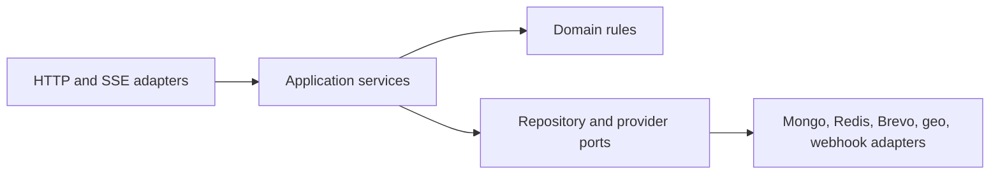

# Repository layout — conceptual ownership map

**Status: Stage 4a.** All nine workspaces exist. `packages/config`, `packages/contracts`,
`packages/database`, `packages/test-utils`, and `apps/server` now carry real content; the
rest remain deliberate shells until the stage that fills them.

This document records the workspace boundaries from blueprint §6 and what each currently contains.

---

## 1. Stage 0 decision, and what changed in Stage 1

Stage 0 deliberately did **not** create these directories. Blueprint §6 calls the workspace table
"a conceptual ownership map, not generated code or a mandate for every directory to exist on day
one", and Stage 0 was forbidden from creating `package.json` files or installing dependencies.
Manufacturing nine empty folders full of placeholder files would have made the repository look
further along than it was.

Stage 1 is the stage that legitimately creates them, because it owns npm workspace boundaries and
the shared build pipeline. Each workspace now has a real `package.json`, a real `tsconfig.json`
extending the shared base, and a `README.md` stating what it is for and which stage fills it in.

The shells are not decoration: every one of them is linted, type-checked, and built by CI, so the
pipeline that later stages depend on is proven before there is any code to break it.

## 2. Workspace ownership map

| Workspace/path            | Responsibility                                                                                                     | Current state                                                                                              |
| ------------------------- | ------------------------------------------------------------------------------------------------------------------ | ---------------------------------------------------------------------------------------------------------- |
| `apps/server`             | Express API, static serving, SSE, and worker bootstrap                                                             | Skeleton: boots, serves `/health/live`, `/health/ready`, `/api/v1`                                         |
| `apps/web`                | React platform, public pages, and dashboard                                                                        | Skeleton: one placeholder view; React 19 + Vite + Tailwind v4                                              |
| `apps/demo`               | Separate-origin anonymous sandbox                                                                                  | Skeleton: placeholder page, no React, own port                                                             |
| `packages/contracts`      | Shared TypeScript contracts and validation schemas                                                                 | **Populated**: error envelope, cursor pagination, Zod validation, revision preconditions, log record shape |
| `packages/database`       | Mongo models, repositories, indexes, and migrations                                                                | **Populated**: connection, migration runner, tenancy-scoped repositories, six foundation records           |
| `packages/widget-runtime` | Framework-free TypeScript loader/runtime build                                                                     | Shell with a Vite library build (ES + IIFE); real runtime in Stage 6                                       |
| `packages/ui`             | Shared accessible React components and design tokens                                                               | Shell; components and tokens with the first real UI                                                        |
| `packages/config`         | Shared lint, TypeScript, test, and build configuration                                                             | **Populated** and consumed by every workspace                                                              |
| `packages/test-utils`     | Fixtures, provider fakes, and tenant helpers                                                                       | **Populated**: isolated-database and two-tenant fixtures, capturing logger                                 |
| `docs/`                   | Architecture decisions and operational runbooks                                                                    | Populated                                                                                                  |
| Repository root           | README, capstone manifest, evidence and build logs, environment example, license, and Docker Compose configuration | Populated                                                                                                  |

### What `packages/config` provides

| File                    | Consumed by             | Purpose                                                                                                                                    |
| ----------------------- | ----------------------- | ------------------------------------------------------------------------------------------------------------------------------------------ |
| `tsconfig.base.json`    | every workspace         | Strict TypeScript baseline (`strict`, `noUncheckedIndexedAccess`, `exactOptionalPropertyTypes`, `verbatimModuleSyntax`, and related flags) |
| `tsconfig.node.json`    | Node workspaces         | Base plus Node types                                                                                                                       |
| `tsconfig.browser.json` | browser workspaces      | Base plus DOM libs, bundler resolution, React JSX                                                                                          |
| `eslint.shared.js`      | root `eslint.config.js` | Shared flat config: ESLint + typescript-eslint recommended + Prettier compatibility                                                        |
| `vitest.shared.js`      | root `vitest.config.ts` | Shared test defaults                                                                                                                       |
| `prettier.shared.json`  | root `.prettierrc.json` | Formatting rules                                                                                                                           |

**Gotcha worth knowing:** relative `outDir` and `rootDir` in an _extended_ tsconfig resolve against
the directory of the **base** file, not the consuming workspace. They are therefore set per
workspace, never in the shared configs.

### What `packages/contracts` provides

| Module           | Purpose                                                                 |
| ---------------- | ----------------------------------------------------------------------- |
| `api.ts`         | `API_VERSION` and the `/api/v1` prefix                                  |
| `errors.ts`      | Error envelope, error codes, and the code-to-HTTP-status table          |
| `validation.ts`  | Zod re-export plus `validate`, mapping a schema failure to field errors |
| `pagination.ts`  | Cursor pagination request/page shapes and opaque cursor encoding        |
| `concurrency.ts` | Revision precondition shape for optimistic concurrency                  |
| `logging.ts`     | Structured log record shape and central redaction of forbidden fields   |

### What `packages/database` provides

| Module                            | Purpose                                                                            |
| --------------------------------- | ---------------------------------------------------------------------------------- |
| `connection.ts`                   | Data-layer Mongo connection, `withTransaction`, replica-set check                  |
| `collections.ts`                  | Canonical collection names                                                         |
| `records/`                        | Record shapes for User, Workspace, Membership, Invitation, AuditEvent, OutboxEvent |
| `repositories/workspace-scope.ts` | `WorkspaceScope` type and its runtime guard                                        |
| `repositories/base-repository.ts` | Tenancy-enforcing base class every workspace-owned repository extends              |
| `repositories/*-repository.ts`    | Concrete repositories                                                              |
| `migrations/`                     | Ordered migration list, runner, and the foundation migration                       |

**Why the logger lives in `packages/contracts`.** Blueprint section 6 has no observability
workspace, and the log record shape in section 16.1 is a shared contract that the server, workers,
and migrations must all produce identically. Putting it in `contracts` avoids inventing a workspace
the blueprint does not name.

**Why Redis lives in `apps/server`.** Blueprint section 6 scopes `packages/database` to "Mongo
models, repositories, indexes, and migrations". Redis is not Mongo, and only the server process
uses it, so the connection and key policy live in `apps/server/src/infrastructure/redis/`.

### What `apps/server` provides after Stage 3a

The layering rule from blueprint section 6.2 is visible in the directory names:
HTTP adapters depend on application services, which depend on ports, which
infrastructure adapters implement.

| Directory                   | Layer                | Contents                                                                                                                                                      |
| --------------------------- | -------------------- | ------------------------------------------------------------------------------------------------------------------------------------------------------------- |
| `src/domain/auth/`          | Domain rules         | Password policy and single-use token generation and hashing. Pure, no I/O.                                                                                    |
| `src/application/auth/`     | Application services | `AuthService` (register, verify, login, reset), `SessionService` (start, rotate, list, revoke), narrow repository ports, and the account-level audit adapter. |
| `src/ports/`                | Ports                | `PasswordHasher`, `BreachChecker`, `EmailSender`, `SessionStore`, `RateLimiter`, `Clock`, plus the Stage 1 dependency probes.                                 |
| `src/infrastructure/auth/`  | Adapters             | Argon2id hasher, offline and HIBP breach checkers.                                                                                                            |
| `src/infrastructure/redis/` | Adapters             | Session store, rate limiter, email-budget counter, key policy, connection.                                                                                    |
| `src/infrastructure/email/` | Adapters             | Mailpit SMTP, Brevo HTTP, capturing fake, and the budget-enforcing wrapper.                                                                                   |
| `src/http/routes/`          | HTTP adapters        | `auth.ts`, `sessions.ts`, `health.ts`.                                                                                                                        |
| `src/http/middleware/`      | HTTP adapters        | Correlation ID, session resolution, `requireAuth`, `requireVerifiedEmail`, CSRF, throttling, error handling.                                                  |
| `src/composition.ts`        | Composition root     | Chooses concrete adapters and injects them downward.                                                                                                          |

**Why the `Clock` port exists.** Session idle and absolute lifetimes, token
expiry, throttle windows, and the daily email budget are all time-dependent.
Injecting time lets the integration tests cross a 30-day boundary in
milliseconds instead of sleeping, and keeps those tests deterministic.

### What `apps/web` provides after Stage 3b

| Path                    | Contents                                                                                                  |
| ----------------------- | --------------------------------------------------------------------------------------------------------- |
| `src/App.tsx`           | Routes for the auth surface. `/` redirects to sign in; there is no dashboard yet.                         |
| `src/pages/`            | Register, login, MFA challenge, MFA setup, verify email, forgot password, reset password, account.        |
| `src/components/ui.tsx` | `AuthPanel` with the mount-bracket signature, `Field`, `Button`, `Alert`, `PasswordStrength`, `CodeList`. |
| `src/lib/api.ts`        | Typed API client that carries cookies and echoes the CSRF token automatically.                            |
| `src/index.css`         | Tailwind v4 `@theme` design tokens, focus-visible ring, reduced-motion handling.                          |

**Components are native semantic elements, not a headless component library.**
For forms the native elements already ARE the accessible primitives: a real
`<label for>`, a real `<button>`, and `aria-describedby` need no JavaScript to
work. A headless library earns its place for composite widgets such as dialogs
and comboboxes, which this surface has none of; Stage 12 can add one when the
dashboard introduces those patterns.

### End-to-end tests

`e2e/` holds the Playwright suite: `fixtures.ts` (shared axe scanner, Mailpit
helpers, throttle isolation) and `tests/` (`auth-journey.spec.ts`,
`accessibility.spec.ts`). `playwright.config.ts` at the root starts the API and
web servers itself and expects Mongo, Redis, and Mailpit to be up.

### What `apps/server` gained in Stage 4a

| Path                                   | Contents                                                                                                           |
| -------------------------------------- | ------------------------------------------------------------------------------------------------------------------ |
| `src/domain/workspace/capabilities.ts` | The section 11 authorization matrix as a static table, plus the role-change and removal asymmetries                |
| `src/domain/workspace/timezone.ts`     | IANA validation by `Intl.DateTimeFormat` construction                                                              |
| `src/domain/workspace/retention.ts`    | The 30-day soft-delete window arithmetic                                                                           |
| `src/application/workspace/`           | `WorkspaceService`, `MembershipService`, `InvitationService`, the workspace-scoped audit adapter, and narrow ports |
| `src/http/middleware/workspace.ts`     | `requireWorkspaceContext` and `requireCapability`                                                                  |
| `src/http/routes/workspaces.ts`        | Onboarding, switcher, current, usage, audit, transfer, delete, recover                                             |
| `src/http/routes/members.ts`           | Members list, role change, removal, and the invitation routes                                                      |

**Where workspace scope comes from.** Only from the server-side session. No
route reads a workspace id out of a body or a path, apart from `/switch` and
`/:workspaceId/recover`, and both verify membership before doing anything.
Membership is re-checked on every request rather than trusted from the session,
so a revoked member loses access immediately.

**The one unscoped invitation lookup.** Redeeming an invitation is the single
flow where the caller has no workspace context - they hold only a link. The
token hash is globally unique, so it resolves to exactly one workspace, which is
the same shape as blueprint 9.1's "public widget identifiers resolve to one
workspace on the server". It is wired in the composition root rather than added
to the scoped repository, so the exception is visible in one place.

## 3. What exists at the root today

| Path                                          | Added in                  | Notes                                                                    |
| --------------------------------------------- | ------------------------- | ------------------------------------------------------------------------ |
| `Embeddable_Widget_Lead_Capture_Blueprint.md` | Pre-existing              | Authoritative source of truth                                            |
| `README.md`                                   | Stage 0, updated Stage 1  | Orientation, architecture, real run commands, non-goals, monorepo caveat |
| `LICENSE`                                     | Stage 0                   | MIT                                                                      |
| `.gitignore`                                  | Stage 0, extended Stage 1 | Established before dependencies or secrets could be committed            |
| `.env.example`                                | Stage 0, updated Stage 1  | Safe placeholders only                                                   |
| `capstone.yaml`                               | Stage 0, updated Stage 1  | Real commands; production URLs still `TBD`                               |
| `EVIDENCE.md`                                 | Stage 0, updated Stage 1  | One entry per requirement; acceptance probes still unproven              |
| `BUILDLOG.md`                                 | Stage 0, updated Stage 1  | AI assistance record                                                     |
| `docs/`                                       | Stage 0, updated Stage 1  | Summary, this file, and the stage checklist                              |
| `package.json`                                | Stage 1                   | npm workspaces root and quality scripts                                  |
| `package-lock.json`                           | Stage 1                   | Single lockfile for every workspace                                      |
| `eslint.config.js`                            | Stage 1                   | Root flat config consuming `@lcp/config/eslint`                          |
| `vitest.config.ts`                            | Stage 1                   | Root config declaring `test.projects`                                    |
| `.prettierrc.json`, `.prettierignore`         | Stage 1                   | Formatting                                                               |
| `docker-compose.yml`                          | Stage 1                   | Six-service local topology                                               |
| `Dockerfile.dev`                              | Stage 1                   | Shared development image for the three apps                              |
| `.dockerignore`                               | Stage 1                   | Keeps `node_modules`, `dist`, and `.env` out of the build context        |
| `.github/workflows/ci.yml`                    | Stage 1                   | CI baseline                                                              |

Root files still to arrive: production Dockerfiles and deployment configuration (Stage 14).

---

## 4. Layering rule that applies inside `apps/server`

Directory boundaries alone do not enforce architecture. Blueprint §6.2 fixes the dependency
direction that every server feature follows:

- Routes do not contain tenant queries, provider logic, or business workflows.
- Domain and application services do not depend on Express objects.
- Provider failures are converted into explicit results rather than leaking transport-specific
  exceptions into core logic.

---

## 5. npm workspaces mechanics used here

Verified against the current npm CLI documentation:

- The root `package.json` declares a `workspaces` array of directory patterns — here
  `["packages/*", "apps/*"]`.
- A single `npm ci` from the repository root symlinks each workspace into the root `node_modules`,
  so there is one lockfile and one install step for an evaluator.
- Scripts run across workspaces with `npm run <script> --workspaces`, and `--if-present` skips
  workspaces that do not define that script. A single workspace is targeted with
  `npm run <script> --workspace=<name>` (or `-w <name>`, repeatable).

Build ordering is explicit rather than implicit: the root `build` script runs `build:packages`
before `build:apps`, because `apps/server` imports `@lcp/contracts` from its compiled output. For
the same reason `typecheck` and `test` build the packages first.

`packages/*` is listed before `apps/*` in the `workspaces` array for readability; it does not by
itself guarantee script ordering, which is why the root scripts sequence the two groups explicitly.

This workspace organisation is exactly what makes the repository technically a monorepo. That
trade-off, and the resulting submission risk, is disclosed in README §3 and
[`architecture-summary.md`](./architecture-summary.md) §5.
