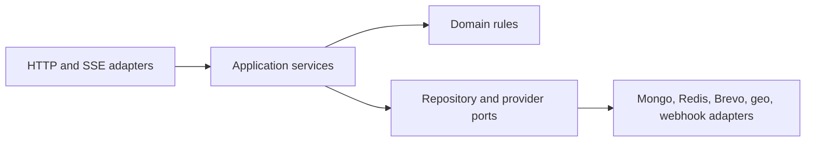

# Repository layout — conceptual ownership map

**Status: Stage 0. Apart from `docs/` and the root files, none of the directories below exist yet.**

This document records the intended workspace boundaries from blueprint §6 so that an evaluator can
see where every future piece of code will live, without the repository pretending to contain code it
does not have.

---

## 1. Why this is a document instead of empty directories

Blueprint §6 states plainly that the workspace table is *"a conceptual ownership map, not generated
code or a mandate for every directory to exist on day one."* Stage 0 is also explicitly forbidden
from creating `package.json` files, installing dependencies, or configuring npm workspaces — that is
Stage 1's job.

Creating nine empty directories, each holding a placeholder file describing code that does not
exist, would add noise that Stage 1 immediately overwrites, and would make the repository look
further along than it is. Documenting the map here is clearer for a stranger and equally verifiable.

**Decision:** Stage 0 creates only `docs/` and the root evaluator files. Every application and
package directory is created by the stage that first puts real code in it. This judgment call is
recorded in [`../BUILDLOG.md`](../BUILDLOG.md).

---

## 2. Workspace ownership map

| Workspace/path | Responsibility | First created in |
| --- | --- | --- |
| `apps/server` | Express API, static serving, SSE, and worker bootstrap | Stage 1 |
| `apps/web` | React platform, public pages, and dashboard | Stage 1 |
| `apps/demo` | Separate-origin anonymous sandbox | Stage 1 |
| `packages/contracts` | Shared TypeScript contracts and validation schemas | Stage 2 |
| `packages/database` | Mongo models, repositories, indexes, and migrations | Stage 2 |
| `packages/widget-runtime` | Framework-free TypeScript loader/runtime build | Stage 6 |
| `packages/ui` | Shared accessible React components and design tokens | Stage 1 |
| `packages/config` | Shared lint, TypeScript, test, and build configuration | Stage 1 |
| `packages/test-utils` | Fixtures, provider fakes, and tenant helpers | Stage 1 |
| `docs/` | Architecture decisions and operational runbooks | **Stage 0 — exists** |
| Repository root | README, capstone manifest, evidence and build logs, environment example, license, and Docker Compose configuration | **Stage 0 — partially exists** |

The "first created in" column is this document's own planning detail, derived from the stage
deliverables in blueprint §19. A later stage may create a directory earlier if it genuinely needs
it; if that happens, this table is updated rather than silently diverging.

---

## 3. What exists at the root today

| Path | Created in | Notes |
| --- | --- | --- |
| `Embeddable_Widget_Lead_Capture_Blueprint.md` | Pre-existing | Authoritative source of truth |
| `README.md` | Stage 0 | Orientation, architecture, non-goals, monorepo caveat, placeholders |
| `LICENSE` | Stage 0 | MIT |
| `.gitignore` | Stage 0 | Established before dependencies or secrets could be committed |
| `.env.example` | Stage 0 | Safe placeholders only |
| `capstone.yaml` | Stage 0 | Machine-readable manifest, all values `TBD` |
| `EVIDENCE.md` | Stage 0 | One entry per requirement, all unproven |
| `BUILDLOG.md` | Stage 0 | AI assistance record |
| `docs/architecture-summary.md` | Stage 0 | One-page evaluator summary |
| `docs/repository-layout.md` | Stage 0 | This file |
| `docs/stage-checklist.md` | Stage 0 | All 16 stages with goals and exit gates |

Root files still to arrive: `package.json` and `package-lock.json`, `docker-compose.yml`, and shared
tooling configuration (Stage 1); `.github/workflows/` (Stage 1).

---

## 4. Layering rule that applies inside `apps/server`

Directory boundaries alone do not enforce architecture. Blueprint §6.2 fixes the dependency
direction that every server feature follows:

- Routes do not contain tenant queries, provider logic, or business workflows.
- Domain and application services do not depend on Express objects.
- Provider failures are converted into explicit results rather than leaking transport-specific
  exceptions into core logic.

---

## 5. npm workspaces mechanics assumed by this plan

For reference when Stage 1 sets up tooling — verified against the current npm CLI documentation:

- The root `package.json` declares a `workspaces` array of directory patterns
  (for example `["apps/*", "packages/*"]`).
- A single install from the repository root symlinks each workspace into the root `node_modules`,
  so there is one lockfile and one install step for an evaluator.
- Scripts run across workspaces with `npm run <script> --workspaces`, and `--if-present` skips
  workspaces that do not define that script. A single workspace is targeted with
  `npm run <script> --workspace=<name>` (or `-w <name>`, repeatable).

This is exactly the mechanism that makes the repository technically a monorepo. That trade-off, and
the resulting submission risk, is disclosed in README §3 and
[`architecture-summary.md`](./architecture-summary.md) §5.
