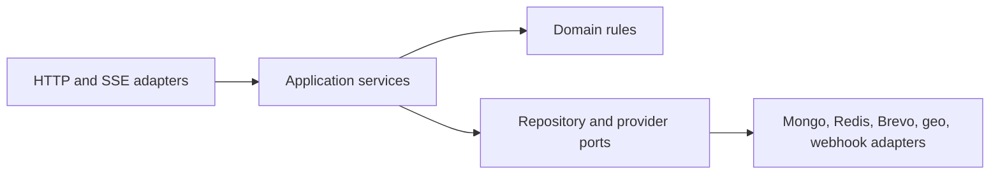

# Repository layout — conceptual ownership map

**Status: Stage 1. All nine workspaces now exist.** Most are deliberately empty shells that carry
only their boundary, build, and type-check wiring; `packages/config` is the one that is genuinely
populated.

This document records the workspace boundaries from blueprint §6 and what each currently contains.

---

## 1. Stage 0 decision, and what changed in Stage 1

Stage 0 deliberately did **not** create these directories. Blueprint §6 calls the workspace table
"a conceptual ownership map, not generated code or a mandate for every directory to exist on day
one", and Stage 0 was forbidden from creating `package.json` files or installing dependencies.
Manufacturing nine empty folders full of placeholder files would have made the repository look
further along than it was.

Stage 1 is the stage that legitimately creates them, because it owns npm workspace boundaries and
the shared build pipeline. Each workspace now has a real `package.json`, a real `tsconfig.json`
extending the shared base, and a `README.md` stating what it is for and which stage fills it in.

The shells are not decoration: every one of them is linted, type-checked, and built by CI, so the
pipeline that later stages depend on is proven before there is any code to break it.

## 2. Workspace ownership map

| Workspace/path            | Responsibility                                                                                                     | Current state                                                         |
| ------------------------- | ------------------------------------------------------------------------------------------------------------------ | --------------------------------------------------------------------- |
| `apps/server`             | Express API, static serving, SSE, and worker bootstrap                                                             | Skeleton: boots, serves `/health/live`, `/health/ready`, `/api/v1`    |
| `apps/web`                | React platform, public pages, and dashboard                                                                        | Skeleton: one placeholder view; React 19 + Vite + Tailwind v4         |
| `apps/demo`               | Separate-origin anonymous sandbox                                                                                  | Skeleton: placeholder page, no React, own port                        |
| `packages/contracts`      | Shared TypeScript contracts and validation schemas                                                                 | Shell exporting `API_VERSION`/`API_PREFIX`; real contracts in Stage 2 |
| `packages/database`       | Mongo models, repositories, indexes, and migrations                                                                | Shell; real models, migrations, and tenancy in Stage 2                |
| `packages/widget-runtime` | Framework-free TypeScript loader/runtime build                                                                     | Shell with a Vite library build (ES + IIFE); real runtime in Stage 6  |
| `packages/ui`             | Shared accessible React components and design tokens                                                               | Shell; components and tokens with the first real UI                   |
| `packages/config`         | Shared lint, TypeScript, test, and build configuration                                                             | **Populated** and consumed by every workspace                         |
| `packages/test-utils`     | Fixtures, provider fakes, and tenant helpers                                                                       | Shell; provider fakes arrive with their providers                     |
| `docs/`                   | Architecture decisions and operational runbooks                                                                    | Populated                                                             |
| Repository root           | README, capstone manifest, evidence and build logs, environment example, license, and Docker Compose configuration | Populated                                                             |

### What `packages/config` provides

| File                    | Consumed by             | Purpose                                                                                                                                    |
| ----------------------- | ----------------------- | ------------------------------------------------------------------------------------------------------------------------------------------ |
| `tsconfig.base.json`    | every workspace         | Strict TypeScript baseline (`strict`, `noUncheckedIndexedAccess`, `exactOptionalPropertyTypes`, `verbatimModuleSyntax`, and related flags) |
| `tsconfig.node.json`    | Node workspaces         | Base plus Node types                                                                                                                       |
| `tsconfig.browser.json` | browser workspaces      | Base plus DOM libs, bundler resolution, React JSX                                                                                          |
| `eslint.shared.js`      | root `eslint.config.js` | Shared flat config: ESLint + typescript-eslint recommended + Prettier compatibility                                                        |
| `vitest.shared.js`      | root `vitest.config.ts` | Shared test defaults                                                                                                                       |
| `prettier.shared.json`  | root `.prettierrc.json` | Formatting rules                                                                                                                           |

**Gotcha worth knowing:** relative `outDir` and `rootDir` in an _extended_ tsconfig resolve against
the directory of the **base** file, not the consuming workspace. They are therefore set per
workspace, never in the shared configs.

## 3. What exists at the root today

| Path                                          | Added in                  | Notes                                                                    |
| --------------------------------------------- | ------------------------- | ------------------------------------------------------------------------ |
| `Embeddable_Widget_Lead_Capture_Blueprint.md` | Pre-existing              | Authoritative source of truth                                            |
| `README.md`                                   | Stage 0, updated Stage 1  | Orientation, architecture, real run commands, non-goals, monorepo caveat |
| `LICENSE`                                     | Stage 0                   | MIT                                                                      |
| `.gitignore`                                  | Stage 0, extended Stage 1 | Established before dependencies or secrets could be committed            |
| `.env.example`                                | Stage 0, updated Stage 1  | Safe placeholders only                                                   |
| `capstone.yaml`                               | Stage 0, updated Stage 1  | Real commands; production URLs still `TBD`                               |
| `EVIDENCE.md`                                 | Stage 0, updated Stage 1  | One entry per requirement; acceptance probes still unproven              |
| `BUILDLOG.md`                                 | Stage 0, updated Stage 1  | AI assistance record                                                     |
| `docs/`                                       | Stage 0, updated Stage 1  | Summary, this file, and the stage checklist                              |
| `package.json`                                | Stage 1                   | npm workspaces root and quality scripts                                  |
| `package-lock.json`                           | Stage 1                   | Single lockfile for every workspace                                      |
| `eslint.config.js`                            | Stage 1                   | Root flat config consuming `@lcp/config/eslint`                          |
| `vitest.config.ts`                            | Stage 1                   | Root config declaring `test.projects`                                    |
| `.prettierrc.json`, `.prettierignore`         | Stage 1                   | Formatting                                                               |
| `docker-compose.yml`                          | Stage 1                   | Six-service local topology                                               |
| `Dockerfile.dev`                              | Stage 1                   | Shared development image for the three apps                              |
| `.dockerignore`                               | Stage 1                   | Keeps `node_modules`, `dist`, and `.env` out of the build context        |
| `.github/workflows/ci.yml`                    | Stage 1                   | CI baseline                                                              |

Root files still to arrive: production Dockerfiles and deployment configuration (Stage 14).

---

## 4. Layering rule that applies inside `apps/server`

Directory boundaries alone do not enforce architecture. Blueprint §6.2 fixes the dependency
direction that every server feature follows:

- Routes do not contain tenant queries, provider logic, or business workflows.
- Domain and application services do not depend on Express objects.
- Provider failures are converted into explicit results rather than leaking transport-specific
  exceptions into core logic.

---

## 5. npm workspaces mechanics used here

Verified against the current npm CLI documentation:

- The root `package.json` declares a `workspaces` array of directory patterns — here
  `["packages/*", "apps/*"]`.
- A single `npm ci` from the repository root symlinks each workspace into the root `node_modules`,
  so there is one lockfile and one install step for an evaluator.
- Scripts run across workspaces with `npm run <script> --workspaces`, and `--if-present` skips
  workspaces that do not define that script. A single workspace is targeted with
  `npm run <script> --workspace=<name>` (or `-w <name>`, repeatable).

Build ordering is explicit rather than implicit: the root `build` script runs `build:packages`
before `build:apps`, because `apps/server` imports `@lcp/contracts` from its compiled output. For
the same reason `typecheck` and `test` build the packages first.

`packages/*` is listed before `apps/*` in the `workspaces` array for readability; it does not by
itself guarantee script ordering, which is why the root scripts sequence the two groups explicitly.

This workspace organisation is exactly what makes the repository technically a monorepo. That
trade-off, and the resulting submission risk, is disclosed in README §3 and
[`architecture-summary.md`](./architecture-summary.md) §5.
